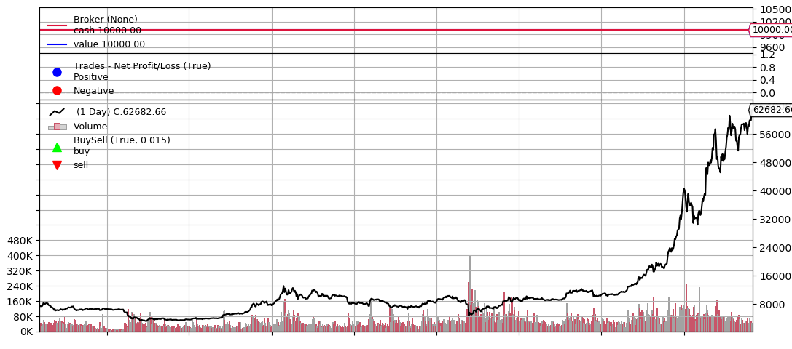
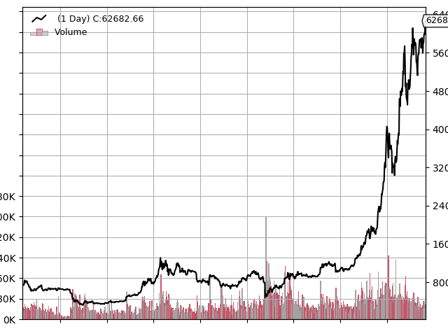
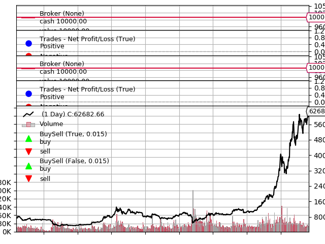

## 一、简介
&emsp;&emsp;在使用cerebro.plot()进行画图时，默认的会把下面三条曲线画上：
- Cash和Value
- Trades
- Buy/Sell  
  
plot()之所以会把这三条曲线画上，是因为在实例化cerebro对象时，参数stdstats默认取值True。
## 二、例子说明
&emsp;&emsp;下面两张图分别把参数取True和False的图形：取True的图像多了broker和Trade两个图，并且在k线图中多了buy/sell。
```python
import backtrader as bt
import pandas as pd

if __name__ == '__main__':
    cerebro = bt.Cerebro(stdstats=False)
    data_path = './dataset/1d/BTC.csv'
    df = pd.read_csv(data_path)
    df['time'] = pd.to_datetime(df['time'])
    data = bt.feeds.PandasData(dataname=df, datetime='time', volume="vol")
    cerebro.adddata(data)

    ret = cerebro.run()  
    cerebro.plot()  
```



&emsp;&emsp;如果我们把stdstats设置为False，但是使用addobserver()方法增加三个观察者，输出的图形和设置为True是一样的。
```python
import backtrader as bt
import pandas as pd

if __name__ == '__main__':
    cerebro = bt.Cerebro(stdstats=False)
    data_path = './dataset/1d/BTC.csv'
    df = pd.read_csv(data_path)
    df['time'] = pd.to_datetime(df['time'])
    data = bt.feeds.PandasData(dataname=df, datetime='time', volume="vol")
    cerebro.adddata(data)

    cerebro.addobserver(bt.observers.Broker)
    cerebro.addobserver(bt.observers.Trades)
    cerebro.addobserver(bt.observers.BuySell)

    ret = cerebro.run()  
    cerebro.plot()  
```


&emsp;&emsp;如果我们把stdstats设置为True，还是用addobserver()方法增加三个观察者，相对于True，就会多出三个观察者：
```python
import backtrader as bt
import pandas as pd

if __name__ == '__main__':
    cerebro = bt.Cerebro(stdstats=True)
    data_path = './dataset/1d/BTC.csv'
    df = pd.read_csv(data_path)
    df['time'] = pd.to_datetime(df['time'])
    data = bt.feeds.PandasData(dataname=df, datetime='time', volume="vol")
    cerebro.adddata(data)

    cerebro.addobserver(bt.observers.Broker)
    cerebro.addobserver(bt.observers.Trades)
    cerebro.addobserver(bt.observers.BuySell)

    ret = cerebro.run()  
    cerebro.plot() 
```


&emsp;&emsp;对比只有True时，每个观察者都多了一条曲线。

## 三、所有观察者
&emsp;&emsp;除了上面三个观察者外，backtrader还支持如下的观察者：
- Benchmark
- Broker
- Buysell
- DrawDown
- TimeReturn
- Trades
- LogReturns
- LogReturns2
- FundValue
- FundShares


