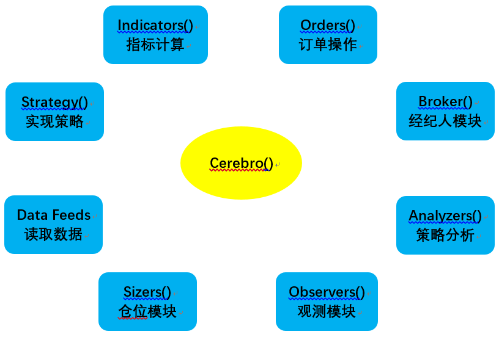
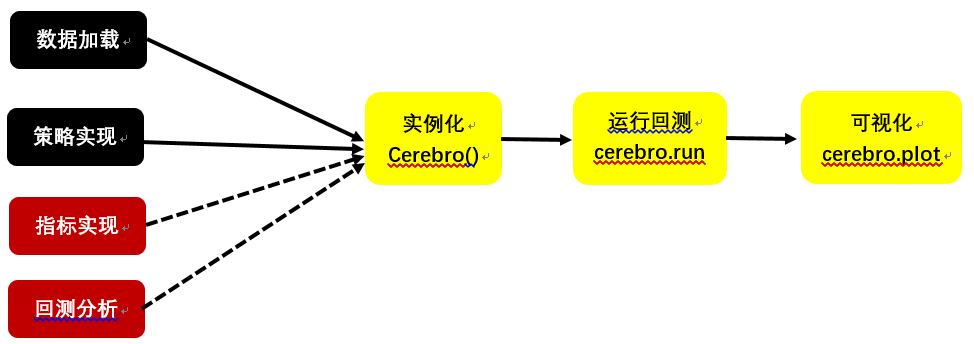

## 一、简介
&emsp;&emsp;Backtrader是一款基于Python功能强大的开源回测框架，并且支持实盘交易。Backtrader有以下一些特性：
- 灵活：可以用Backtrader内置的功能，也可以自己开发
- 支持多种证券：股票、期货、数字货币等等
- 支持多种周期：tick级、秒级、分钟级、天、周、月、年  
## 二、安装
&emsp;&emsp;Backtrader支持python2.7，python3.x。安装命令：
```python
pip install backtrader
```
&emsp;&emsp;如果要用到backtrader的画图功能，安装命令：
```python
pip install backtrader[plotting]
```
## 三、组成模块
&emsp;&emsp;Backtrader包含若干个模块，如下图所示，其中Cerebro是Backtrader的基石，是回测的“大脑”，负责收集数据、策略等等与回测相关的模块，并按一定的逻辑运行这些模块，最后得到回测结果。

## 四、构建回测
&emsp;&emsp;用Backtrader构建回测的流程如下：
- 第一步：创建策略类
  - 确定可调整的参数
  - 计算策略需要的指标
  - 写买卖的逻辑
- 第二步：创建Cerebro的实例对象
  - 添加策略
  - 添加数据
  - 添加其他需要的功能
  - 执行cerebro.run()
  - 可视化  

&emsp;&emsp;可用如下的图来表示以上的步骤：  
  
&emsp;&emsp;红色是可选的。  
&emsp;&emsp;以双均线策略实现一个简单的回测：
```python
import backtrader as bt 
import pandas as pd
# 创建策略类：双均线
class TwoSmaStrategy(bt.Strategy):
    params = (('short', 5), ('long', 10))   #可调整的参数
    def __init__(self):
        self.order = None           #初始化订单
        self.sma_s = bt.indicators.MovingAverageSimple(self.datas[0].lines.close, period=self.params.short) #短期均线指标
        self.sma_l = bt.indicators.MovingAverageSimple(self.datas[0].lines.close, period=self.params.long) #长期均线指标
    
    # 策略方法
    def next(self):
        # 检查是否已经买入
        if not self.position:
            # 如果没有买入，并且短期均线 > 长期均线，说明涨势，买入
            if self.sma_s[0] > self.sma_l[0]:
                self.order = self.buy()
        else:
            # 已经买了，并且短期均线 < 长期均线，说明跌势，卖出
            if self.sma_s[0] < self.sma_l[0]:
                self.order = self.sell()

if __name__ == '__main__':
    cerebro = bt.Cerebro() #实例化cerebro对象
    
    #获取数据
    data_path = './data/sz.000961.csv'
    df = pd.read_csv(data_path)
    df['date'] = pd.to_datetime(df['date'])
    data = bt.feeds.PandasData(dataname=df, datetime='date')
    
    cerebro.addstrategy(TwoSmaStrategy) #加载策略类到cerebro对象中
    cerebro.adddata(data) #加载数据对象到cerebro对象中    
    ret = cerebro.run() #进行回测
    cerebro.plot() #可视化
```
