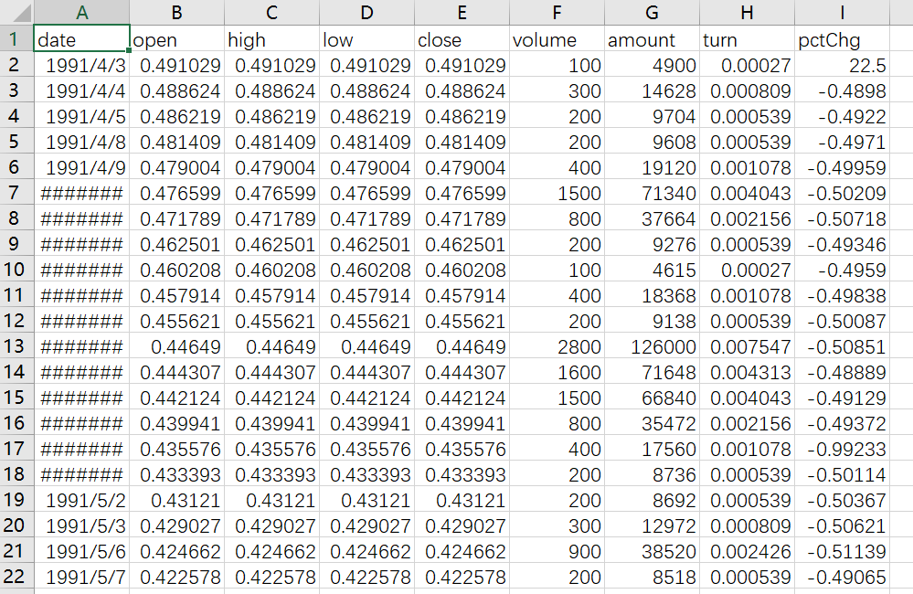
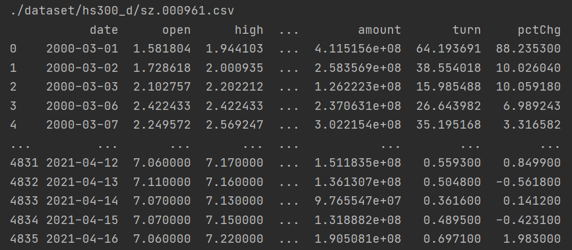

## 一、前言
&emsp;&emsp;数据是量化的基础和源头。处理数据时候，我们要先加载数据，然后提取加载的数据进行处理。在下面代码中，读取的是csv格式数据，并进行一定处理，然后转换成Backtrader的数据对象，再调用adddata加载数据，就完成了数据的加载；数据在策略里面使用，在使用时，发现数据会有些“不正常”，比如说self.datas是什么，lines是什么，close是什么，为什么在next()方法里都是使用下标为0的数据。下面就一一揭开谜底。  
```python
import backtrader as bt 
import pandas as pd
# 创建策略类：双均线
class TwoSmaStrategy(bt.Strategy):
    params = (('short', 5), ('long', 10))   #可调整的参数
    def __init__(self):
        self.order = None           #初始化订单
        self.sma_s = bt.indicators.MovingAverageSimple(self.datas[0].lines.close, period=self.params.short) #短期均线指标
        self.sma_l = bt.indicators.MovingAverageSimple(self.datas[0].lines.close, period=self.params.long) #长期均线指标
    
    # 策略方法
    def next(self):
        # 检查是否已经买入
        if not self.position:
            # 如果没有买入，并且短期均线 > 长期均线，说明涨势，买入
            if self.sma_s[0] > self.sma_l[0]:
                self.order = self.buy()
        else:
            # 已经买了，并且短期均线 < 长期均线，说明跌势，卖出
            if self.sma_s[0] < self.sma_l[0]:
                self.order = self.sell()

if __name__ == '__main__':
    cerebro = bt.Cerebro() #实例化cerebro对象
    
    #获取数据
    data_path = './data/sz.000961.csv'
    df = pd.read_csv(data_path)
    df['date'] = pd.to_datetime(df['date'])
    data = bt.feeds.PandasData(dataname=df, datetime='date')
    
    cerebro.addstrategy(TwoSmaStrategy) #加载策略类到cerebro对象中
    cerebro.adddata(data) #加载数据对象到cerebro对象中    
    ret = cerebro.run() #进行回测
    cerebro.plot() #可视化
```
## 二、数据加载
&emsp;&emsp;Backtrader支持多种数据源，比如Yahoo在线或离线数据，VisualChart数据等等。我在回测时候，用的都是csv格式的数据，因此后面在验证各个功能时所采用的数据格式都是csv格式。
### 2.1 数据实例对象
&emsp;&emsp;在把数据加载到cerebro之前，首先要生成数据实例对象。生成实例对象时确定数据的内容、名字、起止时间、频率以及包含的lines。
```python
import backtrader as bt
df = pd.read_csv(data_path),
# ...... 数据处理
data = bt.feeds.PandasData(dataname=df, datetime='date')
```
&emsp;&emsp;制作数据实例对象时，用到了bt.feeds.PandasData()这个类。这个类有若干个参数，我把这些参数分为两类，一类是数据属性的设置，一类是lines的设置。
- 数据属性设置
  - dataname (None)
    - 必须要提供的，代表数据的地址或者名称
  - name ('')
    - 画图时候装饰用，没有指定，根据dataname来确定
  - fromdate (mindate)
    - 数据起始时间，默认是数据的最小时间
  - todate (maxdate)
    - 数据的截止时间，默认是数据的最大时间
  - timeframe (TimeFrame.Days)
    - 数据的频率，默认是日频。可取值为：Ticks, Seconds, Minutes, Days, Weeks, Months and Years
  - compression (1)
    - 表示每个bar实际的个数，默认为1。只在Resampling和Replaying模式下才有效
  - sessionstart (None)
    - 一段时间的起始时间。只有在如resampling时候才有效
  - sesionend (None)
    - 一段时间的截止时间。只有在如resampling时候才有效
- lines设置
  - datetime (None)
    - 时间line。None：表示datetime是pd.DataFrame里的index；-1：自动检测；>=0表示索引号；字符串：列的名称
  - open (-1)
  - high (-1)
  - low (-1)
  - close (-1)
  - volume (-1)
  - openinterest (-1)
    - 这五个参数值意义一样。None：此列不存在；-1：自动检测，默认；>=0：表示索引号；字符串：列的名称
### 2.2 数据的访问
&emsp;&emsp;下图是某只股票的日线数据。从图中可以看出，数据是一张表，表头说明这列是什么数据。Backtrader里加载数据，也是加载类似于这样的表（data）。表是由多列组成，每一列就是一个line，多列组成的集合就是lines。每一列都是由若干个数据点组成。下面对这几个类型的数据的访问进行介绍。  
  
#### 2.2.1 data的访问
&emsp;&emsp;我们首先来了解数据是怎么加载的。直接看Cerebro.adddata()代码：
```python
    def adddata(self, data, name=None):
        '''
        Adds a ``Data Feed`` instance to the mix.

        If ``name`` is not None it will be put into ``data._name`` which is
        meant for decoration/plotting purposes.
        '''
        if name is not None:
            data._name = name

        data._id = next(self._dataid)
        data.setenvironment(self)

        self.datas.append(data)
        self.datasbyname[data._name] = data
        feed = data.getfeed()
        if feed and feed not in self.feeds:
            self.feeds.append(feed)

        if data.islive():
            self._dolive = True

        return data
```
从代码中可以看出，data被保存到两个地方：一个是self.datas的列表，另一个是self.datasbyname的字典。self.datas会传递给策略的self.datas。那现在就明白上面例子在访问data时候为什么要下标以及下标的含义。这段代码同时也告诉我们，可以加载多个数据。  
&emsp;&emsp;Python里访问列表元素那是很简单的，不过Backtrader对数据的访问进行了一些简化：
- self.datas[X]，可简写为self.dataX，特别的self.datas[0]=self.data0=self.data，这里的X>=0
- self.getdatabyname(name)，通过数据名称来获取数据，这个用的很少
#### 2.2.2 lines的访问
&emsp;&emsp;lines是数据的重要概念。我们用的数据格式如下所示：
数据是二维表格形式的，行表示某个时间各个数据的值，列表示某个特征在不同时间的值。一行称为一个bar，一列成为line，lines表示多个列（line）的集合。比如上图一共有9条line。我们访问数据要指定访问那条line。  
&emsp;&emsp;下面介绍对lines访问的一些方法：
- 访问lines：self.dataX.lines或者简写成self.dataX.l
- 访问具体某一条线：self.dataX_name, self.dataX.lines.name，name为对应线的名称，比如close
- 可以用xx.lines.getlinealiases()获取lines里包含所有线的名称
- 如果记得line在lines中索引的位置，可以通过索引来访问：self.datas[X].lines[Y]，可简写为self.dataX.lines[Y]或self.dataX_Y
### 2.2.3 数据点的访问
&emsp;&emsp;在上述双均线例子中，我们对数据点的访问只用了一个固定下标0。就通过这个固定的下标0，访问完了所有数据。Backtrader对线的访问有些类似于python的迭代器，next()执行自动按顺序更新当前值。下标0就是表示当前值。-1表示上一个值，-2表示上两个值，1表示下一个值，2表示下两个值。用>0的数做下标，在最后一些数据会出问题，因为到了后面的数据，会出现访问出界。  
&emsp;&emsp;每个line对应有个获取切片数据的方法：get，如get(ago=0, size=2)，表示获取昨日今日两天的数据，这个很少用。
## 三、例子
&emsp;&emsp;我们简单修改下上面双均线例子来看看数据访问的情况。  
&emsp;&emsp;首先我们加载三支股票的数据，并打印出来：
```python
class TwoSmaStrategy(bt.Strategy):
    params = (('short', 5), ('long', 10))  
    def __init__(self):
        pass

    def next(self):
        pass

if __name__ == '__main__':
    cerebro = bt.Cerebro() 
    data_paths = ['./dataset/hs300_d/sz.000961.csv', './dataset/hs300_d/sz.000768.csv', './dataset/hs300_d/sz.002508.csv']
    for data_path in data_paths:
        df = pd.read_csv(data_path)
        df['date'] = pd.to_datetime(df['date'])
        print(data_path)
        print(df)
        data = bt.feeds.PandasData(dataname=df, datetime='date')
        cerebro.adddata(data)  

    cerebro.addstrategy(TwoSmaStrategy) 
    ret = cerebro.run()  
```



&emsp;&emsp;我们首先来看self.datas的数据类型，以及长度。改写__init__为：
```python
def __init__(self):
        print(type(self.datas))
        print(len(self.datas))
```
输出结果：
```python
<class 'list'>
3
```
self.datas确实是一个list类型的数据，元素个数和我们输入的数据个数一样
&emsp;&emsp;接下来我们看看self.datas元素的访问，修改__init__为：
```python
def __init__(self):
        print('============ 0 ============')
        print(self.datas[0])
        print(self.data0)
        print(self.data)

        print('============ 1 ============')
        print(self.datas[1])
        print(self.data1)

        print('============ 2 ============')
        print(self.datas[2])
        print(self.data2)
```
得到的输出为：
```python
============ 0 ============
<backtrader.feeds.pandafeed.PandasData object at 0x7f216d52a2d0>
<backtrader.feeds.pandafeed.PandasData object at 0x7f216d52a2d0>
<backtrader.feeds.pandafeed.PandasData object at 0x7f216d52a2d0>
============ 1 ============
<backtrader.feeds.pandafeed.PandasData object at 0x7f216cf1f4d0>
<backtrader.feeds.pandafeed.PandasData object at 0x7f216cf1f4d0>
============ 2 ============
<backtrader.feeds.pandafeed.PandasData object at 0x7f216cf06b10>
<backtrader.feeds.pandafeed.PandasData object at 0x7f216cf06b10>
```
从这里可以看出self.datas[X]和self.dataX效果一样。self.data0可以简写为self.data  
可否通过数据名称来获取数据呢？答案是可以的，前提是知道数据名称。数据名称可通过adddata()传入，我们修改上述代码为：
```python
import backtrader as bt
import pandas as pd

names = ['000961', '000768', '002508']

class TwoSmaStrategy(bt.Strategy):
    params = (('short', 5), ('long', 10)) 
    def __init__(self):
        print('======= 0 =======')
        data = self.getdatabyname(names[0])
        print(data)
        print(self.data)

        print('======= 1 =======')
        data = self.getdatabyname(names[1])
        print(data)
        print(self.data1)

        print('======= 2 =======')
        data = self.getdatabyname(names[2])
        print(data)
        print(self.data2)

    def next(self):
        pass

if __name__ == '__main__':
    cerebro = bt.Cerebro() 
    data_paths = ['./dataset/hs300_d/sz.000961.csv', './dataset/hs300_d/sz.000768.csv', './dataset/hs300_d/sz.002508.csv']
    for i, data_path in enumerate(data_paths):
        df = pd.read_csv(data_path)
        df['date'] = pd.to_datetime(df['date'])
        data = bt.feeds.PandasData(dataname=df, datetime='date')
        cerebro.adddata(data, name=names[i])  

    cerebro.addstrategy(TwoSmaStrategy)  
    ret = cerebro.run() 
```
得到的结果如下：
```python
======= 0 =======
<backtrader.feeds.pandafeed.PandasData object at 0x7f6fb5f4d510>
<backtrader.feeds.pandafeed.PandasData object at 0x7f6fb5f4d510>
======= 1 =======
<backtrader.feeds.pandafeed.PandasData object at 0x7f6fb5945fd0>
<backtrader.feeds.pandafeed.PandasData object at 0x7f6fb5945fd0>
======= 2 =======
<backtrader.feeds.pandafeed.PandasData object at 0x7f6fb5928050>
<backtrader.feeds.pandafeed.PandasData object at 0x7f6fb5928050>
```
可以看出输出的数据对象是一样的。  
&emsp;&emsp;现在我们来测试lines的访问
```python
def __init__(self):
    print('============ 0 ============')
    print(self.data0.lines)
    print(self.data0.l)

    print('============ 1 ============')
    print(self.data1.lines)
    print(self.data1.l)

    print('============ 2 ============')
    print(self.data2.lines)
    print(self.data2.l)
```
得到的输出为：
```python
============ 0 ============
<backtrader.lineseries.Lines_LineSeries_DataSeries_OHLC_OHLCDateTime_AbstractDataBase_DataBase_PandasData object at 0x7f9960b67710>
<backtrader.lineseries.Lines_LineSeries_DataSeries_OHLC_OHLCDateTime_AbstractDataBase_DataBase_PandasData object at 0x7f9960b67710>
============ 1 ============
<backtrader.lineseries.Lines_LineSeries_DataSeries_OHLC_OHLCDateTime_AbstractDataBase_DataBase_PandasData object at 0x7f996055cfd0>
<backtrader.lineseries.Lines_LineSeries_DataSeries_OHLC_OHLCDateTime_AbstractDataBase_DataBase_PandasData object at 0x7f996055cfd0>
============ 2 ============
<backtrader.lineseries.Lines_LineSeries_DataSeries_OHLC_OHLCDateTime_AbstractDataBase_DataBase_PandasData object at 0x7f9960543110>
<backtrader.lineseries.Lines_LineSeries_DataSeries_OHLC_OHLCDateTime_AbstractDataBase_DataBase_PandasData object at 0x7f9960543110>
```
从输出结果可以看到self.dataX.l和self.dataX.lines是等价的  
&emsp;&emsp;然后我们来看看具体line的访问：
```python
def __init__(self):
    print('============ 0 ============')
    print(self.data0.lines.open)
    print(self.data0_open)
    print(self.data0.open)

    print('============ 1 ============')
    print(self.data1.lines.close)
    print(self.data1_close)
    print(self.data1.close)

    print('============ 2 ============')
    print(self.data2.lines.high)
    print(self.data2_high)
    print(self.data2.high)
```
```python
============ 0 ============
<backtrader.linebuffer.LineBuffer object at 0x7fdc5891dd10>
<backtrader.linebuffer.LineBuffer object at 0x7fdc5891dd10>
<backtrader.linebuffer.LineBuffer object at 0x7fdc5891dd10>
============ 1 ============
<backtrader.linebuffer.LineBuffer object at 0x7fdc587f2f50>
<backtrader.linebuffer.LineBuffer object at 0x7fdc587f2f50>
<backtrader.linebuffer.LineBuffer object at 0x7fdc587f2f50>
============ 2 ============
<backtrader.linebuffer.LineBuffer object at 0x7fdc587d9350>
<backtrader.linebuffer.LineBuffer object at 0x7fdc587d9350>
<backtrader.linebuffer.LineBuffer object at 0x7fdc587d9350>
```
可以看出这三种方法的输出效果是一样的。  
&emsp;&emsp;我们在next函数里访问当前数据，看看是什么情况。
```python
def next(self):
    print('data0: date = {}, close = {}'.format(self.data0.datetime.date(), self.data0.close[0]))
    print('data1: date = {}, close = {}'.format(self.data1.datetime.date(), self.data1.close[0]))
    print('data2: date = {}, close = {}'.format(self.data2.datetime.date(), self.data2.close[0]))
    print('----------------------------------------------------')
```
得到的输出如下：
```python
data0: date = 2010-11-23, close = 3.50133623
data1: date = 2010-11-23, close = 12.10237808
data2: date = 2010-11-23, close = 5.8244626
----------------------------------------------------
data0: date = 2010-11-24, close = 3.58877855
data1: date = 2010-11-24, close = 12.4188428
data2: date = 2010-11-24, close = 5.2473708
----------------------------------------------------
data0: date = 2010-11-25, close = 3.6798643
data1: date = 2010-11-25, close = 12.97505352
data2: date = 2010-11-25, close = 5.77240535
----------------------------------------------------
............................................

data0: date = 2021-04-15, close = 7.06
data1: date = 2021-04-15, close = 24.15
data2: date = 2021-04-15, close = 35.5
----------------------------------------------------
data0: date = 2021-04-16, close = 7.2
data1: date = 2021-04-16, close = 24.34
data2: date = 2021-04-16, close = 35.5
----------------------------------------------------
```
对照上面打印的各数据，发现data0和data1都丢失了数据，2010-11-23之前的数据都没了。为什么呢？这是因为Backtrader对数据进行了对齐处理，按照起始时间最大的开始截取。因为我们选股是根据不同股票同一天的数据进行对比的，因此多出的时间就没有意义。那如何实现这个功能的呢？如果我需要对多出的时间进行处理，应该要怎么做？前面的双均线例子是否也有这个情况呢？这个留给后面的策略篇进行详细说明。   
&emsp;&emsp;默认的bt.feeds.PandasData支持的线只有(open, high, low, close, volume, openinterest)，如果我们有其他的line，比如说例子数据中的'turn'，我们怎么来用呢？下一节详细阐述这个问题。
## 四、增加额外line数据
### 4.1 用turn='turn'
```python
import backtrader as bt
import pandas as pd

names = ['000961', '000768', '002508']

class TwoSmaStrategy(bt.Strategy):
    params = (('short', 5), ('long', 10)) 
    def __init__(self):
        pass

    def next(self):
        print('data0: date = {}, close = {}'.format(self.data0.datetime.date(), self.data0.close[0]))

if __name__ == '__main__':
    cerebro = bt.Cerebro() 
    data_paths = ['./dataset/hs300_d/sz.000961.csv']
    for i, data_path in enumerate(data_paths):
        df = pd.read_csv(data_path)
        df['date'] = pd.to_datetime(df['date'])
        data = bt.feeds.PandasData(dataname=df, datetime='date', turn='turn')
        cerebro.adddata(data, name=names[i])  

    cerebro.addstrategy(TwoSmaStrategy)  
    ret = cerebro.run() 
```
提示如下错误，也就是不能用默认以外的名称：
```python
TypeError: __init__() got an unexpected keyword argument 'turn'
```
### 4.2 用没有用到的默认line
&emsp;&emsp;openinterest在做股市量化基本上没用到，试试用这个来接受turn的数据：
```python
import backtrader as bt
import pandas as pd

names = ['000961', '000768', '002508']

class TwoSmaStrategy(bt.Strategy):
    params = (('short', 5), ('long', 10)) 
    def __init__(self):
        pass

    def next(self):
        print('turn: date = {}, turn = {}'.format(self.data0.datetime.date(), self.data0.openinterest[0]))

if __name__ == '__main__':
    cerebro = bt.Cerebro() 
    data_paths = ['./dataset/hs300_d/sz.000961.csv']
    for i, data_path in enumerate(data_paths):
        df = pd.read_csv(data_path)
        df['date'] = pd.to_datetime(df['date'])
        data = bt.feeds.PandasData(dataname=df, datetime='date', openinterest='turn')
        cerebro.adddata(data, name=names[i])  

    cerebro.addstrategy(TwoSmaStrategy)  
    ret = cerebro.run() 
```
得到的输出结果是：
```python
turn: date = 2000-03-01, turn = 64.193691
turn: date = 2000-03-02, turn = 38.554018
turn: date = 2000-03-03, turn = 15.985488
.......................................
turn: date = 2021-04-14, turn = 0.3616
turn: date = 2021-04-15, turn = 0.4895
turn: date = 2021-04-16, turn = 0.6971
```
输出的结果和原数据一致，也就是这样是可以操作的。但是这样实现有两个问题：一是数据不明确，这个例子里，本来是turn数据，结果存放的名称为openinterest，很容易混淆；二是如果默认的都用了，该如何？下面介绍更通用的方法。
### 4.3 创建新数据类
&emsp;&emsp;创建一个继承bt.feeds.PandasData的类，在类中添加新的line名和参数：
```python
import backtrader as bt
import pandas as pd

names = ['000961', '000768', '002508']

class MyData(bt.feeds.PandasData):
    lines = ('turn',)  #增加line的名称
    params = (
        ('turn', 7),  #配置turn的参数，默认第7列
    )

class TwoSmaStrategy(bt.Strategy):
    params = (('short', 5), ('long', 10)) 
    def __init__(self):
        pass

    def next(self):
        print('turn: date = {}, turn = {}'.format(self.data0.datetime.date(), self.data0.turn[0]))
        print('open: date = {}, open = {}'.format(self.data0.datetime.date(), self.data0.open[0]))
        print('------------------------------------------')

if __name__ == '__main__':
    cerebro = bt.Cerebro() 
    data_paths = ['./dataset/hs300_d/sz.000961.csv']
    for i, data_path in enumerate(data_paths):
        df = pd.read_csv(data_path)
        df['date'] = pd.to_datetime(df['date'])
        data = MyData(dataname=df, datetime='date', turn='turn')
        cerebro.adddata(data, name=names[i])  

    cerebro.addstrategy(TwoSmaStrategy)  
    ret = cerebro.run() 
```
输出的结果为：
```python
------------------------------------------
turn: date = 2000-03-01, turn = 64.193691
open: date = 2000-03-01, open = 1.58180396
------------------------------------------
turn: date = 2000-03-02, turn = 38.554018
open: date = 2000-03-02, open = 1.7286181
------------------------------------------
turn: date = 2000-03-03, turn = 15.985488
open: date = 2000-03-03, open = 2.10275736
...............................................
turn: date = 2021-04-14, turn = 0.3616
open: date = 2021-04-14, open = 7.07
------------------------------------------
turn: date = 2021-04-15, turn = 0.4895
open: date = 2021-04-15, open = 7.07
------------------------------------------
turn: date = 2021-04-16, turn = 0.6971
open: date = 2021-04-16, open = 7.06
------------------------------------------
```
与原始数据一致。
