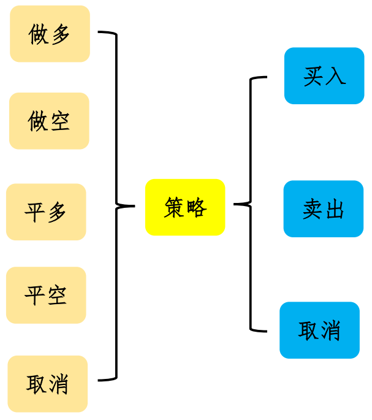
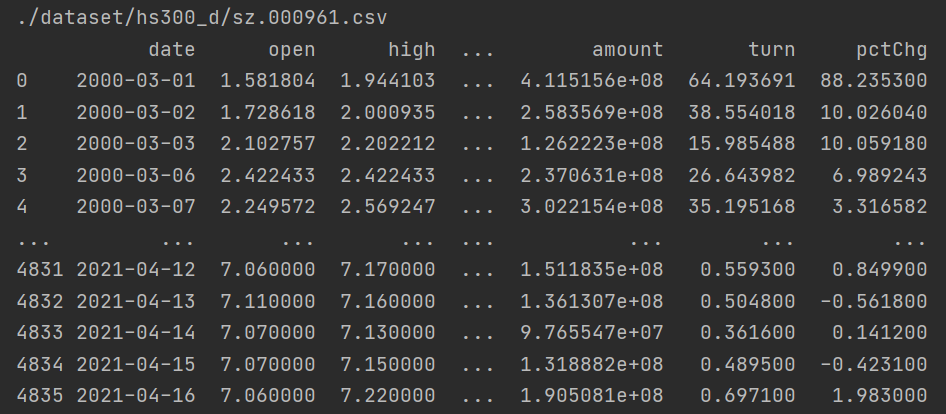
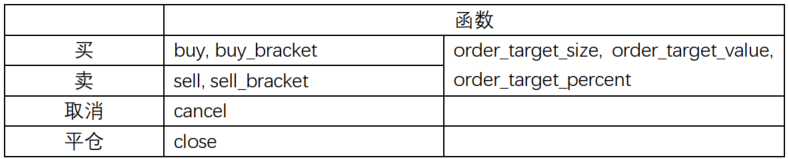

## 一、简介
&emsp;&emsp;策略是根据相应的指标和数据实现对仓位的管理，包括做多、做空、平多、平空、取消订单等等。主要就是买入、卖出、取消三个动作。策略类(bt.Strategy)的属性和方法也是围绕这三个方面的内容展开的。  
<div align=center>

</div>  

&emsp;&emsp;策略类bt.Strategy及其子类不能直接实例化，只能在加载到cerebro中实例化。直接实例化会报错：
```python
worker = bt.Strategy()
```
报错如下：
```python
in <module>
    worker = bt.Strategy()
  File "/root/anaconda3/envs/yujl_ori/lib/python3.7/site-packages/backtrader/metabase.py", line 86, in __call__
    _obj, args, kwargs = cls.donew(*args, **kwargs)
  File "/root/anaconda3/envs/yujl_ori/lib/python3.7/site-packages/backtrader/strategy.py", line 73, in donew
    _obj._id = cerebro._next_stid()
AttributeError: 'NoneType' object has no attribute '_next_stid'
```
报错的原因在于backtrader利用元类改变了Strategy()类实例化的方法。
## 二、属性
&emsp;&emsp;Strategy类的属性包含数据、cerebro实例、分析器、仓位等等。详细介绍如下：  
- env:
  - 策略生存的cerebro实例对象
- datas:
  - 加载的数据队列
- dnames:
  - 用数据名称访问数据的属性
- broker:
  - 经纪人
- stats:
  - 观察者队列
- analyzers:
  - 分析器队列
- position:
  - data0的仓位

## 三、方法
&emsp;&emsp;Strategy里包含很多方法，我们把这些方法分为以下几种：
- 策略准备
- 策略实现
  - 买入
  - 卖出
  - 取消
- 消息通知
- 仓位信息
- 其他
### 3.1 策略准备
&emsp;&emsp;策略准备阶段主要完成指标计算、跳过最小周期等等操作。涉及到三个方法：\_\_init\_\_(), prenext()和nextstart()。   
#### 3.1.1 \_\_init\_\_():  
&emsp;&emsp;这里面除了完成一些初始化任务外，一般还完成指标的计算。比如双均线策略的均线计算。  
#### 3.1.2 prenext():  
&emsp;&emsp;大部分指标需要若干个数据（也就是周期）才能计算得到，当没有达到最小周期的时候，就一直在这个函数中运行。可以不实现。
#### 3.1.3 nextstart():
&emsp;&emsp;这个函数值调用一次。当数据个数满足之后，从prenext转移到next。可以不实现。
#### 3.1.4 例子
&emsp;&emsp;用简单的均线例子测试各个方法的功能。用的数据如下：

1）没有prenext和nextstart方法：
```python
import backtrader as bt
import pandas as pd

class SmaStrategy(bt.Strategy):
    params = (('period', 5), )  # 可调整的参数

    def __init__(self):
        self.sma = bt.indicators.MovingAverageSimple(self.datas[0].lines.close, period=self.params.period)  # 短期均线指标

    def next(self):
        print('next: date = {}, close = {}, sma = {}'.format(self.data0.datetime.date(), self.data0.close[0], self.sma[0]))
        print('------------------------------------------')


if __name__ == '__main__':
    cerebro = bt.Cerebro()  # 实例化cerebro对象
    # 获取数据
    data_paths = ['./dataset/hs300_d/sz.000961.csv']
    for i, data_path in enumerate(data_paths):
        df = pd.read_csv(data_path)
        df['date'] = pd.to_datetime(df['date'])
        data = bt.feeds.PandasData(dataname=df, datetime='date')
        cerebro.adddata(data)  # 加载数据对象到cerebro对象中

    cerebro.addstrategy(SmaStrategy)  # 加载策略类到cerebro对象中
    ret = cerebro.run()  # 进行回测
    cerebro.plot()  # 可视化
```
其输出结果为：
```python
next: date = 2000-03-07, close = 2.43427316, sma = 2.162430204
------------------------------------------
next: date = 2000-03-08, close = 2.28745902, sma = 2.256201816
------------------------------------------
next: date = 2000-03-09, close = 2.19984413, sma = 2.295983712
------------------------------------------
next: date = 2000-03-10, close = 2.20694804, sma = 2.2969309
------------------------------------------
```
从输出结果可以看出，next()方法输出的数据从2000-03-07开始，刚好是第五个数据，与计算均值的周期（数据个数）5一致。我们把周期改为4，next()就从2000-03-06开始输出。
```python
next: date = 2000-03-06, close = 2.35613015, sma = 2.094469465
------------------------------------------
next: date = 2000-03-07, close = 2.43427316, sma = 2.248387515
------------------------------------------
next: date = 2000-03-08, close = 2.28745902, sma = 2.3200186074999998
------------------------------------------
next: date = 2000-03-09, close = 2.19984413, sma = 2.319426615
------------------------------------------
```
2）重写策略类的方法prenext()如下，period=5：
```python
def prenext(self):
    print('prenext: date = {}, close = {}, sma = {}'.format(self.data0.datetime.date(), self.data0.close[0], self.sma[0]))
    print('==========================================')
```
输出结果如下：
```python
prenext: date = 2000-03-01, close = 1.81860096, sma = nan
==========================================
prenext: date = 2000-03-02, close = 2.00093465, sma = nan
==========================================
prenext: date = 2000-03-03, close = 2.2022121, sma = nan
==========================================
prenext: date = 2000-03-06, close = 2.35613015, sma = nan
==========================================
next: date = 2000-03-07, close = 2.43427316, sma = 2.162430204
------------------------------------------
next: date = 2000-03-08, close = 2.28745902, sma = 2.256201816
```
输出结果中prenext()一共有4个，第5个输出就是next()。最小周期为n，前n-1个数据是在prenext()中获得，从第n个数据开始，可从next()方法中获取。均值个数和源数据个数一样，前面n-1个数据用nan填充。均值填充的位置是参与计算的源数据最后一个数据的位置。这两个方法已经可以访问所有数据了，那nextstart()方法有什么用呢？  
3）再重写nextstart()方法(period=5)：
```python
def nextstart(self):
    print('nextstart: date = {}, close = {}, sma = {}'.format(self.data0.datetime.date(), self.data0.close[0], self.sma[0]))
    print('>>>>>>>>>>>>>>>>>>>>>>>>>>>>>>>>>>>>>>>>>>>')
```
输出结果如下：
```python
prenext: date = 2000-03-01, close = 1.81860096, sma = nan
==========================================
prenext: date = 2000-03-02, close = 2.00093465, sma = nan
==========================================
prenext: date = 2000-03-03, close = 2.2022121, sma = nan
==========================================
prenext: date = 2000-03-06, close = 2.35613015, sma = nan
==========================================
nextstart: date = 2000-03-07, close = 2.43427316, sma = 2.162430204
>>>>>>>>>>>>>>>>>>>>>>>>>>>>>>>>>>>>>>>>>>>
next: date = 2000-03-08, close = 2.28745902, sma = 2.256201816
------------------------------------------
next: date = 2000-03-09, close = 2.19984413, sma = 2.295983712
------------------------------------------
next: date = 2000-03-10, close = 2.20694804, sma = 2.2969309
```
从输出结果可以知道：前面n-1(4)个数据仍然是在prenext()方法中获得的，而第n(5)个数据是在nextstart()方法中获得的，next()方法从第n+1(6)个数据开始。如果nextstart()方法中不获取数据是不是也是这样呢？
```python
def nextstart(self):
    pass
```
输出结果为：
```python
prenext: date = 2000-03-01, close = 1.81860096, sma = nan
==========================================
prenext: date = 2000-03-02, close = 2.00093465, sma = nan
==========================================
prenext: date = 2000-03-03, close = 2.2022121, sma = nan
==========================================
prenext: date = 2000-03-06, close = 2.35613015, sma = nan
==========================================
next: date = 2000-03-08, close = 2.28745902, sma = 2.256201816
------------------------------------------
next: date = 2000-03-09, close = 2.19984413, sma = 2.295983712
------------------------------------------
```
和上面输出结果对比，发现2000-03-07这一条数据（也就是第n个数据）没有显示。这也就是说，只要重写了nextstart()方法，不管有没有使用数据，第n个数据都会在nextstart()中消耗掉。  
4）多个数据  
&emsp;&emsp;上面测试的都是一个数据，下面用多个数据来测试看看数据如何实现对齐（以两个数据为例）：
```python
import backtrader as bt
import pandas as pd
class SmaStrategy(bt.Strategy):
    params = (('period', 5), )  # 可调整的参数

    def __init__(self):
        self.sma0 = bt.indicators.MovingAverageSimple(self.datas[0].lines.close, period=self.params.period)  # 短期均线指标
        self.sma1 = bt.indicators.MovingAverageSimple(self.datas[1].lines.close, period=self.params.period)

    def prenext(self):
        print('prenext: date0 = {}, date1 = {}, close = {}, sma0 = {}, sma1 = {}'.format(self.data0.datetime.date(), self.data1.datetime.date(), self.data0.close[0], self.sma0[0], self.sma1[0]))
        print('==========================================')

    def nextstart(self):
        pass

    def next(self):
        print('next: date0 = {}, date1 = {}, close = {}, sma0 = {}, sma1 = {}'.format(self.data0.datetime.date(), self.data1.datetime.date(), self.data0.close[0], self.sma0[0], self.sma1[0]))
        print('------------------------------------------')


if __name__ == '__main__':
    cerebro = bt.Cerebro()  # 实例化cerebro对象
    # 获取数据
    data_paths = ['./dataset/hs300_d/sz.000961.csv', './dataset/hs300_d/sz.000768.csv']#, './dataset/hs300_d/sz.000768.csv', './dataset/hs300_d/sz.002508.csv']
    for i, data_path in enumerate(data_paths):
        df = pd.read_csv(data_path)
        df['date'] = pd.to_datetime(df['date'])
        data = bt.feeds.PandasData(dataname=df, datetime='date')
        cerebro.adddata(data)  # 加载数据对象到cerebro对象中

    cerebro.addstrategy(SmaStrategy)  # 加载策略类到cerebro对象中
    ret = cerebro.run()  # 进行回测
    cerebro.plot()  # 可视化
```
输出结果为：
```python
prenext: date0 = 2021-04-16, date1 = 1997-06-26, close = 7.2, sma0 = 7.109999999999999, sma1 = nan
==========================================
prenext: date0 = 2021-04-16, date1 = 1997-06-27, close = 7.2, sma0 = 7.109999999999999, sma1 = nan
==========================================
prenext: date0 = 2021-04-16, date1 = 1997-07-02, close = 7.2, sma0 = 7.109999999999999, sma1 = nan
==========================================
prenext: date0 = 2021-04-16, date1 = 1997-07-03, close = 7.2, sma0 = 7.109999999999999, sma1 = nan
==========================================
prenext: date0 = 2021-04-16, date1 = 1997-07-04, close = 7.2, sma0 = 7.109999999999999, sma1 = 1.94268242
==========================================
prenext: date0 = 2021-04-16, date1 = 1997-07-07, close = 7.2, sma0 = 7.109999999999999, sma1 = 1.92049217
............................................................
prenext: date0 = 2000-03-02, date1 = 2000-03-02, close = 2.00093465, sma0 = nan, sma1 = 3.5291982000000006
==========================================
prenext: date0 = 2000-03-03, date1 = 2000-03-03, close = 2.2022121, sma0 = nan, sma1 = 3.6263790200000003
==========================================
prenext: date0 = 2000-03-06, date1 = 2000-03-06, close = 2.35613015, sma0 = nan, sma1 = 3.6412118820000003
==========================================
next: date0 = 2000-03-08, date1 = 2000-03-08, close = 2.28745902, sma0 = 2.256201816, sma1 = 3.788517546
------------------------------------------
next: date0 = 2000-03-09, date1 = 2000-03-09, close = 2.19984413, sma0 = 2.295983712, sma1 = 3.7813568539999998
------------------------------------------
next: date0 = 2000-03-10, date1 = 2000-03-10, close = 2.20694804, sma0 = 2.2969309, sma1 = 3.736858268
------------------------------------------
next: date0 = 2000-03-13, date1 = 2000-03-13, close = 2.19984413, sma0 = 2.265673696, sma1 = 3.7670354700000006
------------------------------------------
next: date0 = 2000-03-14, date1 = 2000-03-14, close = 2.21641992, sma0 = 2.222103048, sma1 = 3.725094274
------------------------------------------
next: date0 = 2000-03-15, date1 = 2000-03-15, close = 2.3442903, sma0 = 2.2334693039999998, sma1 = 3.675480908
...........................................................
next: date0 = 2021-04-13, date1 = 2021-04-13, close = 7.08, sma0 = 7.122, sma1 = 24.386000000000003
------------------------------------------
next: date0 = 2021-04-14, date1 = 2021-04-14, close = 7.09, sma0 = 7.0920000000000005, sma1 = 24.176
------------------------------------------
next: date0 = 2021-04-15, date1 = 2021-04-15, close = 7.06, sma0 = 7.081999999999999, sma1 = 24.026
------------------------------------------
next: date0 = 2021-04-16, date1 = 2021-04-16, close = 7.2, sma0 = 7.109999999999999, sma1 = 23.991999999999997
------------------------------------------

Process finished with exit code 0
```
从上面输出的信息来看，首先获得时间早的有效数据，等到有时间对齐，就获取对应数据的有效数，一直到所有的数据对齐，并且满足最小周期，就进入到nextstart()或者next()方法中。
### 3.2 策略实现
&emsp;&emsp;策略实现是在next()方法中，其定义如下：
```python
next()
```  
这是一个必须要由开发者实现的方法。在这个方法里，运行判断逻辑，实现策略。  
&emsp;&emsp;策略的目的是为了进行买卖，并在某些情况下，取消买卖。Backtrader中有很多种买卖方式：

从上图可以看到，买卖行为的方法是相对应的，order_target_XXX这类方法可能是买可能是卖。下面看看函数的定义：
```python
buy(data=None, size=None, price=None, plimit=None, exectype=None, valid=None, tradeid=0, oco=None, trailamount=None, trailpercent=None, parent=None, transmit=True, **kwargs)
sell(data=None, size=None, price=None, plimit=None, exectype=None, valid=None, tradeid=0, oco=None, trailamount=None, trailpercent=None, parent=None, transmit=True, **kwargs)

buy_bracket(data=None, size=None, price=None, plimit=None, exectype=2, valid=None, tradeid=0, trailamount=None, trailpercent=None, oargs={}, stopprice=None, stopexec=3, stopargs={}, limitprice=None, limitexec=2, limitargs={}, **kwargs)
sell_bracket(data=None, size=None, price=None, plimit=None, exectype=2, valid=None, tradeid=0, trailamount=None, trailpercent=None, oargs={}, stopprice=None, stopexec=3, stopargs={}, limitprice=None, limitexec=2, limitargs={}, **kwargs)

order_target_size(data=None, target=0, **kwargs)
order_target_value(data=None, target=0.0, price=None, **kwargs)
order_target_percent(data=None, target=0.0, **kwargs)

cancel(order)
```
从函数定义来看，buy和sell的参数是一致的，buy_bracket和sell_bracket的参数是一致的。  
#### 3.2.1 buy()
&emsp;&emsp;创建一个买的订单，并且将订单发送给经纪人。买涉及到买什么、量多少、价格多少、订单有效期等等。  
- data
  - 表示创建哪支股票买的订单。默认为None，表示买入self.datas[0]
- size: (None)  
  - 表示买入多少。默认为None，通过getsizer获取大小
- price: (None)
  - 表示以什么价格买。默认为None，表示市价或者收盘价。对于限价单、止损单、止损限价单这个值是一个触发价。   
- plimit: (None)
  - 这个参数只用于限价止损单。当止损条件触发后，这个参数值用于限价止损。   
- exectype: (None)，执行类型，有以下几种取值
  - Order.Market或None: 市价订单，在下一个bar成交
  - Order.Limit: 限价单，将会以一个不次于定价的价格成交
  - Order.Stop: 止损单，当price被触发时，以市价成交
  - Order.StopLimit: 止损限价单。在price被触发后，以pricelimit价格成交
  - Order.Close: 收盘价订单。以收盘价成交
  - Order.StopTrail: 跟踪止损市价单。在price - trailmount(trailpercent)被触发，如果价格离开止损区间，则更新订单
  - Order.StopTrailLimt: 跟踪止损限价单。
- valid：(None)，有效期，有以下几种值
  - None：订单不会自动取消，要么成交，要么自己取消
  - datetime.datetime或datetime.date：到这个时间前订单有效
  - Order.DAY或0或timedelta(): 当日有效
  - 数字：用数字表示时间，到期之前有效
- tradeid：(0)
  - backtrader内部值，用于跟踪同一资产上不同的有重叠的交易
- oco：(None)
  - Order cancel Others. 如果执行了一个订单，其他订单就会被取消
- trailamount: (None)
  - 如果订单类型是跟踪止损或者是跟踪止损限价单，这个参数表示止损区间
- trailpercent: (None)  
  - 如果订单类型是跟踪止损或者是跟踪止损限价单，这个参数表示止损区间的百分比
- parent
  - 控制一组订单的关系。一般用于一篮子订单，用于控制这一篮子订单，只有这个parent订单成交后，另外止盈和止损订单才会成交；如果这个parent订单被取消了，则止盈和止损订单也会被取消。
- transmit：(True)
  - 用于控制一篮子订单。transmit只能一个为正，并且是止盈止损中的一个，为正的时候，订单最后一个下。

#### 3.2.2 buy_bracket()  
&emsp;&emsp;创建一篮子订单。默认创建三个订单：发布一个限价买入订单、发布一个低价止损订单、发布一个高价限价卖出订单。返回一个订单列表[order, stop_side, limit_side]。和buy方法有很多相同的参数：
- data:  参见buy
- size:  参见buy
- price: 参见buy
- plimit：参见buy
- exectype：参见buy
- valid：参见buy
- tradeid：参见buy
- trailamount：参见buy
- trailpercent：参见buy
- oargs：字典型数据，和buy里的kwargs一样
- stopprice：(None)
  - 止损价
- stopexec：(Order.Stop)
  - 止损的类型
- stopargs: ({})
  - 默认空
- limitprice: (None)
  - 限价
- limitexec: (Order.Limit)
  - 限价类型
- limitargs: ({})
  - 默认空
#### 3.2.3 sell()和sell_bracket()
&emsp;&emsp;参数意义和buy()、buy_bracket()一致。
#### 3.2.4 order_target_XXX()
&emsp;&emsp;这三个方法都表示达到预定的值，进行买或卖。    
1）order_target_size(data=None, target=0, **kwargs)  
&emsp;&emsp;在指定数据(data)上的仓位达到指定值(target):  
- 如果target > pos.size，则买入target-pos.size
- 如果target < pos.size，则卖出pos.size-target
- 返回订单或者None(pos.size==target)  

2）order_target_value(data=None, target=0.0, price=None, **kwargs)  
&emsp;&emsp;在指定数据(data)上的资产达到指定值(target)
- 如果target > value，则买入
- 如果target < vlaue，则卖出
- 返回订单或者None(value==target)  

3）order_target_percent(data=None, target=0.0, **kwargs)  
&emsp;&emsp;在指定数据(data)上的资产达到当前组合资产值的百分比(假设目标百分比的资产为target):  
- 如果target > value:
  - 如果pos.size >= 0，则买入
  - 如果pos.size < 0, 则卖出
- 如果target < value
  - 如果pos.size >= 0，则卖出
  - 如果pos.size < 0，则买入
- 返回订单或者None(pos.size == target)

#### 3.2.5 cancel(order)
&emsp;&emsp;取消指定的订单
#### 3.2.6 close(data=None, size=None, **kwargs)
&emsp;&emsp;实现平仓。平指定数据指定大小仓位。
### 3.3 消息通知
&emsp;&emsp;消息通知方法都是以notify_开头的，通知的内容是什么，方法名称后面就是什么，比如通知订单消息，后面就跟order，也就是notify_order。一共会通知以下几种消息：
- notify_order(order)
- notify_trade(trade)
- notify_cashvalue(cash, value)
- notify_fund(cash, value, fundvalue, shares)
- notify_store(msg, *args, **kwargs)
- notify_timer(timer, when, *args, **kwargs)

&emsp;&emsp;这些方法可以不重写，也可以重写。重写时可根据需要输出相关信息。

### 3.4 仓位信息
&emsp;&emsp;有关仓位的方法一共有6种，分别描述如下：
#### 3.4.1 getsizer()
&emsp;&emsp;返回自动股本计算的Sizer实例对象。
#### 3.4.2 setsizer(sizer)
&emsp;&emsp;替换默认的sizer
#### 3.4.3 getsizing(data=None, isbuy=True)
&emsp;&emsp;返回当前sizer实例计算出的股本
#### 3.4.4 getposition(data=None, broker=None)
&emsp;&emsp;返回指定经纪人指定数据上当前的仓位
#### 3.4.5 getpositionbyname(name=None, broker=None)
&emsp;&emsp;返回指定经纪人中指定名称的仓位
#### 3.4.6 getpositionsbyname(broker=None)
&emsp;&emsp;返回指定经纪人中仓位

### 3.5 其他
#### 3.5.1 start()
&emsp;&emsp;在回测即将开始前调用，一般不用管。在实盘时，调试时可能需要用上。
#### 3.5.2 stop()
&emsp;&emsp;在回测即将结束时候调用。可以在这里做一些善后工作，比如保存相关数据。
#### 3.5.3 getdatanames()
&emsp;&emsp;返回数据名称列表
#### 3.5.4 getdatabyname(name)
&emsp;&emsp;返回指定名称的数据
#### 3.5.5 add_timer(when, offset=datetime.timedelta(0), repeat=datetime.timedelta(0), weekdays=[], weekcarry=False, monthdays=[], monthcarry=True, allow=None, tzdata=None, cheat=False, *args, **kwargs)
&emsp;&emsp;调度一个计时器来调用notify_timer。很少用


