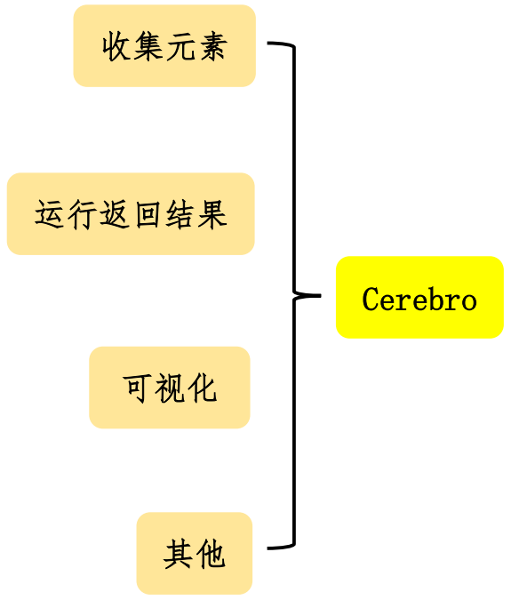
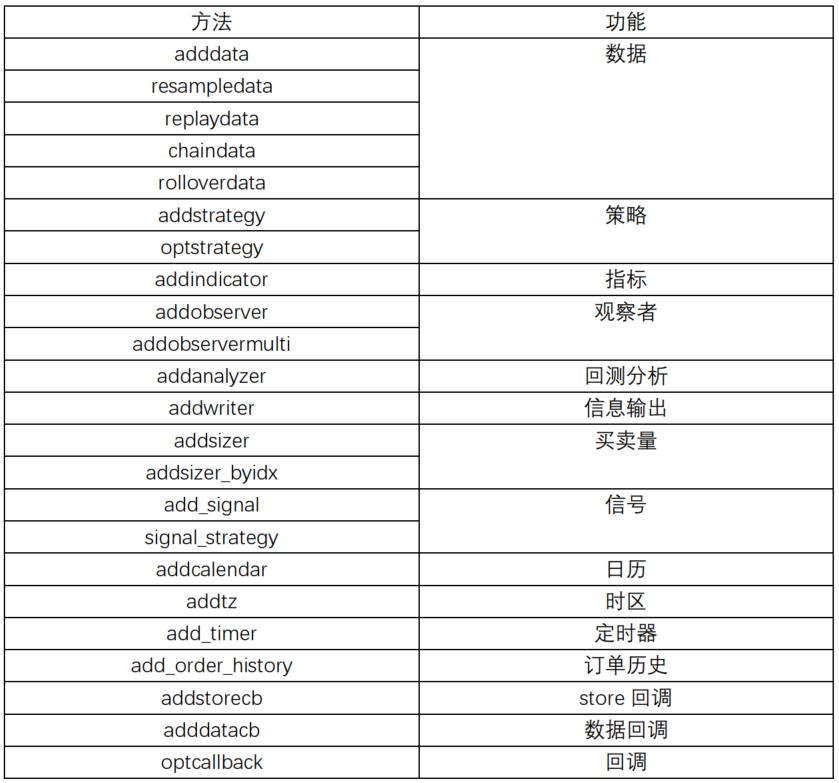
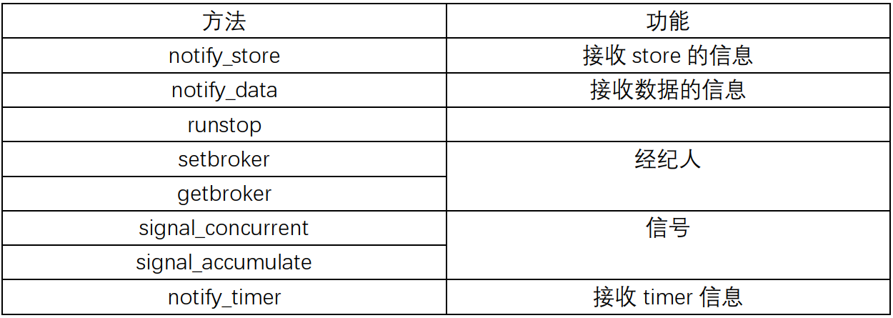

## 一、简介
&emsp;&emsp;Cerebro是Backtrader的基石和大脑，主要负责以下的任务：
- 收集回测相关的元素，如数据、策略、观察者、评价、输出数据等等
- 执行回测或者交易
- 返回数据
- 画图  

&emsp;&emsp;Cerebro所做的工作就是把相关的数据、策略等等组织起来，使得策略等能顺里运行，并获得结果数据。就像人的大脑，加工各种信息，然后输出一个反馈。因此可以将Cerebro的方法划分为如下图所示几种：
<div align=center>

</div> 

## 二、实例化
&emsp;&emsp;Cerebro实例化很简单：
```python
import backtrader as bt
cerebro = bt.Cerebro()
```
一般情况下，用默认的参数就可以了。有些情况下，也需要修改其中的参数。实例化时候，有以下参数可供修改：
```python
params = (
        ('preload', True),
        ('runonce', True),
        ('maxcpus', None),
        ('stdstats', True),
        ('oldbuysell', False),
        ('oldtrades', False),
        ('exactbars', False),
        ('optdatas', True),
        ('optreturn', True),
        ('objcache', False),
        ('live', False),
        ('writer', False),
        ('tradehistory', False),
        ('oldsync', False),
        ('tz', None),
        ('cheat_on_open', False),
        ('broker_coo', True),
        ('quicknotify', False),
    )
```
参数的意义如下所示：   
- preload
  - 默认值为True。这个参数用来决定在回测时是否把数据加载之后再传给Cerebro。为True表示先加载再传递，在回测时，速度会快些。
- runonce
  - 为True时，在计算指标时采用向量模式，以加快系统的速度。但是策略和观察者以事件方式驱动
- maxcpus
  - 优化时，使用的cpu核数。默认为None，表示使用可获取的所有核
- stdstats
  - 控制是否加载Observer。默认为True，表示加载观察者：Broker, Trades和BuySell
- oldbuysell
  - 如果stdstats为True，这个开关控制BuySell观察者的行为：如果oldbuysell为True，买卖信号就会画在平均价的位置；否则买卖点就会画在最高点和最低点之外的位置。
- oldtrades
  - 如果stdstats为True，这个开关控制Trades观察者的行为：
- exactbars
  - 控制存储多少k线数据在内存中。默认False，所有数据都保存。如果为True或1，只保存最小周期的数据在内存里，以减少内存使用，这会取消preload、runonce和plotting；如果为-1，数据、指标和计算结果会保存，中间结果会丢掉，会取消runonce；如果为-2，数据、指标会保存下来，但是指标内的变量，如果不是属性，怎会丢弃，会取消runonce。
- optdatas
  - 默认True。如果为True，如果preload和runonce也为True，则数据只加载一次，可以节省很多资源和时间
- optreturny
  - 默认True。如果为True，返回结果中只包含参数和analyzers。
- objcache
  - 默认False。是否使用缓存。如果为True，如果上面计算过了，形成了一条Line，再用到同样名字的，就不在计算，而是用上面计算的结果。
- live
  - 默认False。实盘模式。如果数据没有传入islive的方法，则表示回测模式。如果为True，则取消preload和runonce
- writer
  - 默认False。如果为True，创建一个默认的文件，并把输出信息保存到这个文件中。
- tradehistory
  - 默认False。如果为True，将会更新所有策略每次交易的信息日志。
- oldsync
  - 默认False。如果为False，数据可以有不同长度；如果为True，就会使用旧版本那种用data0作为主数据的方式。
- tz
  - 默认None。给策略添加时区
- cheat_on_open
  - 默认False。如果为True，将会调用策略的next_open方法，将会使用开盘价进行交易。
- broker_coo
  - 默认True。如果cheat_on_open为True，broker_coo为True，就会激活cheat_on_open。
- quicknotify
  - 默认False。控制broker发送消息的时间。如果为False，只有再next的时候才会发送；如果为True，有消息就会立即发送。

## 三、方法说明
&emsp;&emsp;Cerebro的方法分为四类：收集元素、运行返回结果、可视化和其他。
### 3.1 收集元素
&emsp;&emsp;收集元素的方法大多时以add开头，具体有以下方法：
<div align=center>

</div> 

&emsp;&emsp;收集元素的方法有很多，常用的方法有以下几种：
- adddata
- addstrategy
- addanalyzer

#### 3.1.1 adddata(data, name=None)
&emsp;&emsp;加载数据data。如果name不为none，则将data._name设置为name。
#### 3.1.2 addstrategy(strategy, *args, **kwargs)
&emsp;&emsp;加载策略strategy
#### 3.1.3 addanalyzer(ancls, *args, **kwargs)
&emsp;&emsp;加载回测分析方法
### 3.2 运行返回结果
&emsp;&emsp;这个就只有一个函数：
```python
run(**kwargs)
```
返回包含所有策略结果的列表。
### 3.3 可视化
&emsp;&emsp;可视化就是画出图形：
```python
plot(plotter=None, numfigs=1, iplot=True, start=None, end=None, width=16, height=9, dpi=300, tight=True, use=None, **kwargs)
```

### 3.3 其他
&emsp;&emsp;其他的方法如下：
<div align=center>

</div> 
&emsp;&emsp;这些方法不怎么常用。在有些情况下，需要更改broker，就用setbroker的方法。
