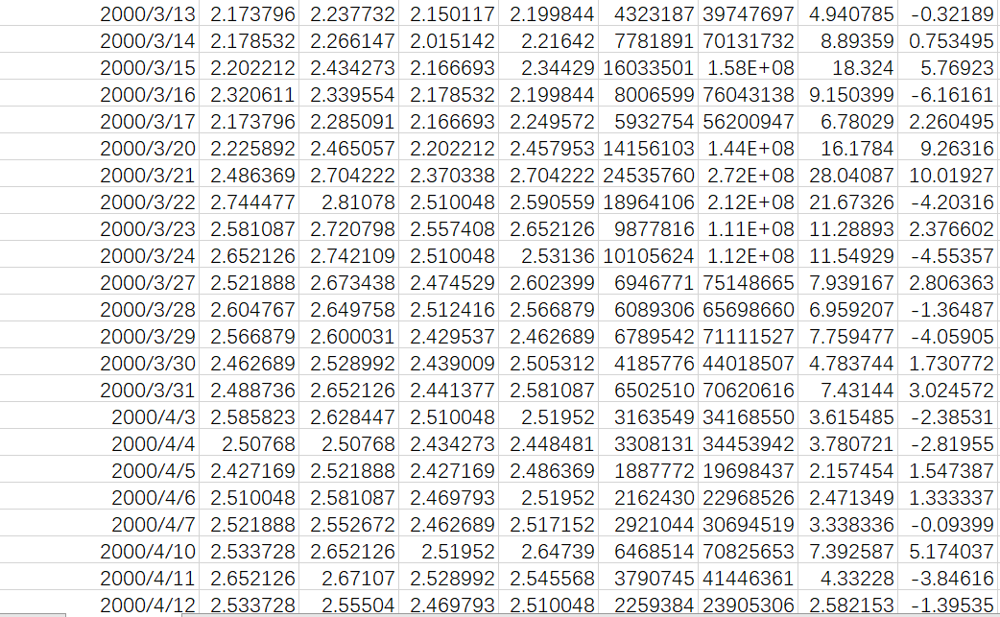

## 一、一个简单的双均线例子
&emsp;&emsp;本篇主要从买卖仓位设置（整数、小数）、买卖价格设置（市价、限价）、cheat on open模式等方面进行分析。
### 1.1 整数仓位买卖
&emsp;&emsp;废话不多说，先上代码
```python
import backtrader as bt
import pandas as pd


# 创建策略类：双均线
class TwoSmaStrategy(bt.Strategy):
    params = (('short', 5), ('long', 10))  # 可调整的参数

    def log(self, txt, dt=None, doprint=True):
        if doprint:
            dt = dt or self.datas[0].datetime.date(0)
            print('%s, %s' % (dt.isoformat(), txt))

    def __init__(self):
        self.order = None  # 初始化订单
        self.sma_s = bt.indicators.MovingAverageSimple(self.datas[0].lines.close, period=self.params.short)  # 短期均线指标
        self.sma_l = bt.indicators.MovingAverageSimple(self.datas[0].lines.close, period=self.params.long)  # 长期均线指标

    def notify_order(self, order):
        if order.status in [order.Submitted, order.Accepted]:
            # 如订单已被处理，则不用做任何事情
            return

        # 检查订单是否完成
        if order.status in [order.Completed]:
            if order.isbuy():
                self.buy_price = order.executed.price
                self.buy_comm = order.executed.comm
            self.bar_executed = len(self)

        # 订单因为缺少资金之类的原因被拒绝执行
        elif order.status in [order.Canceled, order.Margin, order.Rejected]:
            # print(self.datas)
            self.log(
                'Order status: {}, Canceled-{}/Margin-{}/Rejected-{}'.format(order.status, order.Canceled, order.Margin,
                                                                             order.Rejected), doprint=True)
        self.log('Value: {:.6f}, price: {:.6f}, size: {}'.format(order.executed.value, order.executed.price,
                                                                    order.executed.size), doprint=True)
        # 订单状态处理完成，设为空
        self.order = None

    def notify_trade(self, trade):
        if not trade.isclosed:
            return

        self.log('OPERATION PROFIT, GROSS %.2f, NET %.2f' %
                 (trade.pnl, trade.pnlcomm), doprint=False)

    # 策略方法
    def next(self):
        # 是否正在下单，如果是的话不能提交第二次订单
        if self.order:
            return

        # 是否已经买入
        if not self.position:
            # 还没买，如果 MA5 > MA10 说明涨势，买入
            if self.sma_s[0] > self.sma_l[0]:
                self.order = self.buy()
        else:
            # 已经买了，如果 MA5 < MA10 ，说明跌势，卖出
            if self.sma_s[0] < self.sma_l[0]:
                self.order = self.sell()


names = ['000961', '000768', '002508']

if __name__ == '__main__':
    # worker = bt.Strategy()
    cerebro = bt.Cerebro()  # 实例化cerebro对象
    # 获取数据
    data_paths = ['./dataset/hs300_d/sz.000961.csv']
    for i, data_path in enumerate(data_paths):
        df = pd.read_csv(data_path)
        df['date'] = pd.to_datetime(df['date'])
        data = bt.feeds.PandasData(dataname=df, datetime='date')
        cerebro.adddata(data, name=names[i])  # 加载数据对象到cerebro对象中

    cerebro.addstrategy(TwoSmaStrategy)  # 加载策略类到cerebro对象中
    ret = cerebro.run()  # 进行回测
```
输出结果如下：
```python
2000-03-15, Value: 2.202212, price: 2.202212, size: 1
2000-03-16, Value: 2.202212, price: 2.320611, size: -1
2000-03-21, Value: 2.486369, price: 2.486369, size: 1
2000-04-03, Value: 2.486369, price: 2.585823, size: -1
2000-04-12, Value: 2.533728, price: 2.533728, size: 1
2000-04-18, Value: 2.533728, price: 2.375074, size: -1
2000-05-24, Value: 2.356130, price: 2.356130, size: 1
2000-06-12, Value: 2.356130, price: 2.320611, size: -1
..............................................
```
上面的输出是notify_order()方法的输出。从输出可以看出，每次买卖的大小是1，价格是执行买卖时候的价格，是变化的。代码中买卖函数没有设置任何参数，买卖量也没有设置，也就是说默认的买卖量是1。把买入的size设置为2，则输出为：
```python
2000-03-15, Value: 4.404424, price: 2.202212, size: 2
2000-03-16, Value: 2.202212, price: 2.320611, size: -1
2000-03-17, Value: 2.202212, price: 2.173796, size: -1
2000-03-21, Value: 4.972737, price: 2.486369, size: 2
2000-04-03, Value: 2.486369, price: 2.585823, size: -1
```
从上可以看出，买入size变成了2，而卖出size还是为1。注：order中size的方法是用符号来表示，正数表示买入，负数表示卖出。买入还是为2，卖出改为3：
```python
2000-03-15, Value: 4.404424, price: 2.202212, size: 2
2000-03-16, Value: 2.083814, price: 2.320611, size: -3
2000-03-17, Value: -6.521389, price: 2.173796, size: -3
2000-03-20, Value: -6.677675, price: 2.225892, size: -3
2000-04-03, Value: -7.757470, price: 2.585823, size: -3
2000-04-04, Value: -7.523041, price: 2.507680, size: -3
```
卖出的仓位大于已有的仓位，会导致后面无法再买入。如果要全部卖出，怎么获得仓位呢？
```python
def next(self):
        if self.order:
            return

        if not self.position:
            if self.sma_s[0] > self.sma_l[0]:
                self.order = self.buy(size=5)
        else:
            if self.sma_s[0] < self.sma_l[0]:
                self.order = self.sell(size=self.position.size)
```
输出结果如下：
```python
2000-03-15, Value: 11.011061, price: 2.202212, size: 5
2000-03-16, Value: 11.011061, price: 2.320611, size: -5
2000-03-21, Value: 12.431843, price: 2.486369, size: 5
2000-04-03, Value: 12.431843, price: 2.585823, size: -5
2000-04-12, Value: 12.668640, price: 2.533728, size: 5
2000-04-18, Value: 12.668640, price: 2.375074, size: -5
2000-05-24, Value: 11.780651, price: 2.356130, size: 5
```
买卖的仓位又一致了。  
### 1.2 小数仓位买卖
&emsp;&emsp;上面的买卖都是正数买卖，在股市、期货等市场中，都是正数买卖，但是在加密货币市场上，买卖大小是可以小数的。我们把size设置为小数看看：
```python
def next(self):
        if self.order:
            return

        if not self.position:
            if self.sma_s[0] > self.sma_l[0]:
                self.order = self.buy(size=5.8752)
        else:
            if self.sma_s[0] < self.sma_l[0]:
                self.order = self.sell(size=self.position.size)
```
输出结果是：
```python
2000-03-15, Value: 12.938437, price: 2.202212, size: 5.8752
2000-03-16, Value: 12.938437, price: 2.320611, size: -5.8752
2000-03-21, Value: 14.607912, price: 2.486369, size: 5.8752
2000-04-03, Value: 14.607912, price: 2.585823, size: -5.8752
2000-04-12, Value: 14.886158, price: 2.533728, size: 5.8752
2000-04-18, Value: 14.886158, price: 2.375074, size: -5.8752
2000-05-24, Value: 13.842736, price: 2.356130, size: 5.8752
2000-06-12, Value: 13.842736, price: 2.320611, size: -5.8752
2000-06-19, Value: 14.023596, price: 2.386914, size: 5.8752
```
买卖仓位的大小就是小数了。如果买卖仓位大小和收盘价成反比关系：
```python
def next(self):
        if self.order:
            return

        if not self.position:
            if self.sma_s[0] > self.sma_l[0]:
                self.order = self.buy(size=3/self.data0.close[0])
        else:
            if self.sma_s[0] < self.sma_l[0]:
                self.order = self.sell(size=self.position.size)
```
输出结果如下：
```python
2000-03-15, Value: 2.980769, price: 2.202212, size: 1.3535341263310792
2000-03-16, Value: 2.980769, price: 2.320611, size: -1.3535341263310792
2000-03-21, Value: 3.034682, price: 2.486369, size: 1.2205278827031696
2000-04-03, Value: 3.034682, price: 2.585823, size: -1.2205278827031696
2000-04-12, Value: 2.986047, price: 2.533728, size: 1.1785190160426884
2000-04-18, Value: 2.986047, price: 2.375074, size: -1.1785190160426884
2000-05-24, Value: 3.045918, price: 2.356130, size: 1.292763206373357
2000-06-12, Value: 3.045918, price: 2.320611, size: -1.292763206373357
```
也可以正确交易。但是要注意的是，如果要进行all-in交易，这样计算就会有些问题：
```python
def next(self):
        if self.order:
            return

        if not self.position:
            if self.sma_s[0] > self.sma_l[0]:
                self.order = self.buy(price=self.data0.close[0], size=self.broker.getcash() /self.data0.close[0])
        else:
            if self.sma_s[0] < self.sma_l[0]:
                self.order = self.sell(size=self.position.size)
```
上述代码表示以收盘价all-in某只股票。看看输出效果：
```python
2000-03-15, Value: 9935.897436, price: 2.202212, size: 4511.780421103597
2000-03-16, Value: 9935.897436, price: 2.320611, size: -4511.780421103597
2000-03-21, Order status: 7, Canceled-5/Margin-7/Rejected-8
2000-03-21, Value: 0.000000, price: 0.000000, size: 0
2000-03-22, Order status: 7, Canceled-5/Margin-7/Rejected-8
2000-03-22, Value: 0.000000, price: 0.000000, size: 0
2000-03-23, Value: 10495.671807, price: 2.581087, size: 4066.376138215856
2000-04-03, Value: 10495.671807, price: 2.585823, size: -4066.376138215856
2000-04-12, Order status: 7, Canceled-5/Margin-7/Rejected-8
2000-04-12, Value: 0.000000, price: 0.000000, size: 0
```
输出结果里有很多提示Order状态为Margin，也就是账户里现金不够。为什么会出现这种情况呢？因为计算机不能准确表示浮点数，只能以一定精度来表示浮点数。在计算size的时候，很有可能因为精度问题导致size的大小比计算的理论值大，因此就会出现账户里现金不够的问题。这可以通过截断size浮点位数来解决，比如只保留小数点后5位，第6位及其以后的数据全部丢掉，注意不要五入，否则也会出现Margin问题。

### 1.3 买卖价格
&emsp;&emsp;buy()方法的默认价格是收盘价或者市价，在判断可以买入，那买入价格是当前bar的价格还是下一个bar的价格？
```python
def next(self):
        if self.order:
            return

        if not self.position:
            if self.sma_s[0] > self.sma_l[0]:
                print('buy: date={}, close={}, open={}'.format(self.data0.datetime.date(), self.data0.close[0], self.data0.open[0]))
                self.order = self.buy()
        else:
            if self.sma_s[0] < self.sma_l[0]:
                print('sell: date={}, close={}, open={}'.format(self.data0.datetime.date(), self.data0.close[0], self.data0.open[0]))
                self.order = self.sell()
```
输出结果为：
```python
buy: date=2000-03-14, close=2.21641992, open=2.1785324
2000-03-15, Value: 2.202212, price: 2.202212, size: 1
sell: date=2000-03-15, close=2.3442903, open=2.2022121
2000-03-16, Value: 2.202212, price: 2.320611, size: -1
buy: date=2000-03-20, close=2.45795286, open=2.2258918
2000-03-21, Value: 2.486369, price: 2.486369, size: 1
sell: date=2000-03-31, close=2.5810873, open=2.48873647
2000-04-03, Value: 2.486369, price: 2.585823, size: -1
buy: date=2000-04-11, close=2.54556775, open=2.6521264
2000-04-12, Value: 2.533728, price: 2.533728, size: 1
sell: date=2000-04-17, close=2.40822549, open=2.49347241
2000-04-18, Value: 2.533728, price: 2.375074, size: -1
buy: date=2000-05-23, close=2.3206106, open=2.29456293
2000-05-24, Value: 2.356130, price: 2.356130, size: 1
sell: date=2000-06-09, close=2.32297857, open=2.33245045
2000-06-12, Value: 2.356130, price: 2.320611, size: -1

```
数据如下图所示(从左到右依次是：date, open, high, low, close, volume, amount, turn, pctChg)：

从输出信息可以看出，创建订单和执行订单时价格不一样。执行订单时不是以当前的bar价格成交，而是以下一个bar的开盘价成交。因为当前数据用于趋势预测，预测下一步是涨还是跌，下一个bar才是执行趋势的数据。  
&emsp;&emsp;我们修改买入价格，改为收盘价：
```python
def next(self):
        if self.order:
            return

        if not self.position:
            if self.sma_s[0] > self.sma_l[0]:
                print('buy: date={}, close={}, open={}'.format(self.data0.datetime.date(), self.data0.close[0], self.data0.open[0]))
                self.order = self.buy(price=self.data0.close[0])
        else:
            if self.sma_s[0] < self.sma_l[0]:
                print('sell: date={}, close={}, open={}'.format(self.data0.datetime.date(), self.data0.close[0], self.data0.open[0]))
                self.order = self.sell()
```
输出结果为：
```python
buy: date=2000-03-14, close=2.21641992, open=2.1785324
2000-03-15, Value: 2.202212, price: 2.202212, size: 1
sell: date=2000-03-15, close=2.3442903, open=2.2022121
2000-03-16, Value: 2.202212, price: 2.320611, size: -1
buy: date=2000-03-20, close=2.45795286, open=2.2258918
2000-03-21, Value: 2.486369, price: 2.486369, size: 1
sell: date=2000-03-31, close=2.5810873, open=2.48873647
2000-04-03, Value: 2.486369, price: 2.585823, size: -1
buy: date=2000-04-11, close=2.54556775, open=2.6521264
2000-04-12, Value: 2.533728, price: 2.533728, size: 1
sell: date=2000-04-17, close=2.40822549, open=2.49347241
2000-04-18, Value: 2.533728, price: 2.375074, size: -1
buy: date=2000-05-23, close=2.3206106, open=2.29456293
2000-05-24, Value: 2.356130, price: 2.356130, size: 1
sell: date=2000-06-09, close=2.32297857, open=2.33245045
2000-06-12, Value: 2.356130, price: 2.320611, size: -1

```
对比上面的结果发现买入价格还是开盘价买的，设置的值无效。buy()方法里还有个参数exectype，在默认时表示市价订单，在下一个bar以开盘价执行。我们改变这个参数：
```python
def next(self):
        if self.order:
            return

        if not self.position:
            if self.sma_s[0] > self.sma_l[0]:
                print('buy: date={}, close={}, open={}'.format(self.data0.datetime.date(), self.data0.close[0], self.data0.open[0]))
                self.order = self.buy(price=self.data0.close[0], exectype=bt.Order.Limit)
        else:
            if self.sma_s[0] < self.sma_l[0]:
                print('sell: date={}, close={}, open={}'.format(self.data0.datetime.date(), self.data0.close[0], self.data0.open[0]))
                self.order = self.sell()
```
输出结果为：
```python
buy: date=2000-03-14, close=2.21641992, open=2.1785324
2000-03-15, Value: 2.202212, price: 2.202212, size: 1
sell: date=2000-03-15, close=2.3442903, open=2.2022121
2000-03-16, Value: 2.202212, price: 2.320611, size: -1
buy: date=2000-03-20, close=2.45795286, open=2.2258918
2000-03-21, Value: 2.457953, price: 2.457953, size: 1
sell: date=2000-03-31, close=2.5810873, open=2.48873647
2000-04-03, Value: 2.457953, price: 2.585823, size: -1
buy: date=2000-04-11, close=2.54556775, open=2.6521264
2000-04-12, Value: 2.533728, price: 2.533728, size: 1
sell: date=2000-04-17, close=2.40822549, open=2.49347241
2000-04-18, Value: 2.533728, price: 2.375074, size: -1
buy: date=2000-05-23, close=2.3206106, open=2.29456293
2000-05-24, Value: 2.320611, price: 2.320611, size: 1
sell: date=2000-06-09, close=2.32297857, open=2.33245045
2000-06-12, Value: 2.320611, price: 2.320611, size: -1
```
上述例子用的是限价单，价格限定为创建订单bar的收盘价。对比2000-03-21的买入数据，买入的价格和限定价格是一致的，小于开盘价。我们把价格限定为开盘价：
```python
buy: date=2000-03-14, close=2.21641992, open=2.1785324
2000-03-15, Value: 2.178532, price: 2.178532, size: 1
sell: date=2000-03-15, close=2.3442903, open=2.2022121
2000-03-16, Value: 2.178532, price: 2.320611, size: -1
buy: date=2000-03-20, close=2.45795286, open=2.2258918
2000-05-11, Value: 2.225892, price: 2.225892, size: 1
sell: date=2000-05-11, close=2.15248473, open=2.2732512
2000-05-12, Value: 2.225892, price: 2.152485, size: -1
buy: date=2000-05-23, close=2.3206106, open=2.29456293
2000-05-25, Value: 2.294563, price: 2.294563, size: 1
sell: date=2000-06-09, close=2.32297857, open=2.33245045
2000-06-12, Value: 2.294563, price: 2.320611, size: -1
buy: date=2000-06-16, close=2.39401767, open=2.4153294
2000-06-19, Value: 2.386914, price: 2.386914, size: 1
sell: date=2000-06-22, close=2.3206106, open=2.35613015
2000-06-23, Value: 2.386914, price: 2.313507, size: -1
```
看输出结果：在2000-03-20这条bar这里开始下订单，但是执行订单却在2000-05-11。这是因为直到5-11这条数据的最低价才小于设定的限价，这时候才能执行买入。
### 1.4 cheat on open
&emsp;&emsp;cheat_on_open是一个特殊的模式：在当前bar判断买入，则以当前bar的开盘价买入；卖出也是如此。要实现这个功能，就需要在开启的next_open()方法中实现策略。这个模式有什么用呢？主要是在all-in时候用。next方法中只能在下一个bar进行交易，如果我们要all-in，就需要根据价格和总资金量决定买入量，但是我们不知道下一个bar的开盘价。如果我们用当前的开盘价来计算买入量，在当前开盘价大于下一个开盘价时候，买的数量就少了；在当前开盘价小于下一个开盘价时候，买的数量就多了，资金就不够，无法买入；如果用下标[1]来获取下一个数据，在最后一个数据时候程序会发生问题。因此就设置了这一个模式，可用当前开盘价下单和执行订单。
```python
import backtrader as bt
import pandas as pd

class TwoSmaStrategy(bt.Strategy):
    params = (('short', 5), ('long', 10))

    def log(self, txt, dt=None, doprint=True):
        if doprint:
            dt = dt or self.datas[0].datetime.date(0)
            print('%s, %s' % (dt.isoformat(), txt))

    def __init__(self):
        self.order = None  # 初始化订单
        self.sma_s = bt.indicators.MovingAverageSimple(self.datas[0].lines.close, period=self.params.short)  
        self.sma_l = bt.indicators.MovingAverageSimple(self.datas[0].lines.close, period=self.params.long)  

    def notify_order(self, order):
        if order.status in [order.Submitted, order.Accepted]:
            return

        if order.status in [order.Completed]:
            if order.isbuy():
                self.buy_price = order.executed.price
                self.buy_comm = order.executed.comm
            self.bar_executed = len(self)

        elif order.status in [order.Canceled, order.Margin, order.Rejected]:
            self.log(
                'Order status: {}, Canceled-{}/Margin-{}/Rejected-{}'.format(order.status, order.Canceled, order.Margin,
                                                                             order.Rejected), doprint=True)
        self.log('Value: {:.6f}, price: {:.6f}, size: {}'.format(order.executed.value, order.executed.price,
                                                                    order.executed.size), doprint=True)
        self.order = None

    def notify_trade(self, trade):
        if not trade.isclosed:
            return

        self.log('OPERATION PROFIT, GROSS %.2f, NET %.2f' %
                 (trade.pnl, trade.pnlcomm), doprint=False)

    def next_open(self):
        if self.order:
            return

        if not self.position:
            if self.sma_s[0] > self.sma_l[0]:
                print('next_open >>> buy: date={}, close={}, open={}'.format(self.data0.datetime.date(), self.data0.close[0], self.data0.open[0]))
                self.order = self.buy()
        else:
            if self.sma_s[0] < self.sma_l[0]:
                print('next_open >>> sell: date={}, close={}, open={}'.format(self.data0.datetime.date(), self.data0.close[0],
                                                          self.data0.open[0]))
                self.order = self.sell()


names = ['000961', '000768', '002508']

if __name__ == '__main__':
    # worker = bt.Strategy()
    cerebro = bt.Cerebro(cheat_on_open=True)  # 打开cheat on open模式
    data_paths = ['./dataset/hs300_d/sz.000961.csv']
    for i, data_path in enumerate(data_paths):
        df = pd.read_csv(data_path)
        df['date'] = pd.to_datetime(df['date'])
        data = bt.feeds.PandasData(dataname=df, datetime='date')
        cerebro.adddata(data, name=names[i])  

    cerebro.addstrategy(TwoSmaStrategy) 
    ret = cerebro.run() 
```
其输出为：
```python
next_open >>> buy: date=2000-03-15, close=2.3442903, open=2.2022121
2000-03-15, Value: 2.202212, price: 2.202212, size: 1
next_open >>> sell: date=2000-03-16, close=2.19984413, open=2.3206106
2000-03-16, Value: 2.202212, price: 2.320611, size: -1
next_open >>> buy: date=2000-03-21, close=2.70422174, open=2.4863685
2000-03-21, Value: 2.486369, price: 2.486369, size: 1
next_open >>> sell: date=2000-04-03, close=2.51952008, open=2.58582324
2000-04-03, Value: 2.486369, price: 2.585823, size: -1
next_open >>> buy: date=2000-04-12, close=2.5100482, open=2.5337279
2000-04-12, Value: 2.533728, price: 2.533728, size: 1
next_open >>> sell: date=2000-04-18, close=2.41769737, open=2.37507391
2000-04-18, Value: 2.533728, price: 2.375074, size: -1
next_open >>> buy: date=2000-05-24, close=2.32534654, open=2.35613015
2000-05-24, Value: 2.356130, price: 2.356130, size: 1
next_open >>> sell: date=2000-06-12, close=2.32534654, open=2.3206106
2000-06-12, Value: 2.356130, price: 2.320611, size: -1
next_open >>> buy: date=2000-06-19, close=2.34192233, open=2.38691376
2000-06-19, Value: 2.386914, price: 2.386914, size: 1
next_open >>> sell: date=2000-06-23, close=2.33718639, open=2.31350669
2000-06-23, Value: 2.386914, price: 2.313507, size: -1
```
从输出结果可以看出，比如在2000-03-15这条bar创建一个订单，执行订单时候也是这一条bar的开盘价。卖出同样如此。没有开启cheat on open时候，是用创建订单的下一条bar来执行订单的。开启cheat on open，next()同样有效，我们来看看两个一起执行，加入next()如下：
```python
def next(self):
    if self.order:
        return

    if not self.position:
        if self.sma_s[0] > self.sma_l[0]:
            print('next >>> buy: date={}, close={}, open={}'.format(self.data0.datetime.date(), self.data0.close[0], self.data0.open[0]))
            self.order = self.buy()
    else:
        if self.sma_s[0] < self.sma_l[0]:
            print('next >>> sell: date={}, close={}, open={}'.format(self.data0.datetime.date(), self.data0.close[0],
                                                        self.data0.open[0]))
            self.order = self.sell()
```
输出结果如下：
```python
next >>> buy: date=2000-03-14, close=2.21641992, open=2.1785324
2000-03-15, Value: 2.202212, price: 2.202212, size: 1
next >>> sell: date=2000-03-15, close=2.3442903, open=2.2022121
2000-03-16, Value: 2.202212, price: 2.320611, size: -1
next >>> buy: date=2000-03-20, close=2.45795286, open=2.2258918
2000-03-21, Value: 2.486369, price: 2.486369, size: 1
next >>> sell: date=2000-03-31, close=2.5810873, open=2.48873647
2000-04-03, Value: 2.486369, price: 2.585823, size: -1
next >>> buy: date=2000-04-11, close=2.54556775, open=2.6521264
2000-04-12, Value: 2.533728, price: 2.533728, size: 1
next >>> sell: date=2000-04-17, close=2.40822549, open=2.49347241
2000-04-18, Value: 2.533728, price: 2.375074, size: -1
next >>> buy: date=2000-05-23, close=2.3206106, open=2.29456293
2000-05-24, Value: 2.356130, price: 2.356130, size: 1
next >>> sell: date=2000-06-09, close=2.32297857, open=2.33245045
2000-06-12, Value: 2.356130, price: 2.320611, size: -1
next >>> buy: date=2000-06-16, close=2.39401767, open=2.4153294
2000-06-19, Value: 2.386914, price: 2.386914, size: 1
next >>> sell: date=2000-06-22, close=2.3206106, open=2.35613015
2000-06-23, Value: 2.386914, price: 2.313507, size: -1
```
里面没有next_open()的输出，也就是说在cheat on open模式下，如果同时实现next()和next_open()，优先执行next()方法。如果同时实现next()和next_open()方法，希望在开启cheat_on_open时候能够执行next_open()，没有开启时候，执行next()，这个可不可以实现呢？答案是肯定的：可将next()和next_open()修改如下，并增加一个操作函数：
```python

def operate(self, is_cheat):
    if self.order:
        return

    if not self.position:
        if self.sma_s[0] > self.sma_l[0]:
            print('buy: ischeat={}, date={}, close={}, open={}'.format(is_cheat, self.data0.datetime.date(), self.data0.close[0], self.data0.open[0]))
            self.order = self.buy()
    else:
        if self.sma_s[0] < self.sma_l[0]:
            print('sell: ischeat={}, date={}, close={}, open={}'.format(is_cheat, self.data0.datetime.date(), self.data0.close[0],
                                                        self.data0.open[0]))
            self.order = self.sell()

def next(self):
    if self.cerebro.p.cheat_on_open:
        return
    self.operate(is_cheat=False)

def next_open(self):
    if not self.cerebro.p.cheat_on_open:
        return
    self.operate(is_cheat=True)
```
开启cheat_on_open时候的输出为：
```python
buy: ischeat=True, date=2000-03-15, close=2.3442903, open=2.2022121
2000-03-15, Value: 2.202212, price: 2.202212, size: 1
sell: ischeat=True, date=2000-03-16, close=2.19984413, open=2.3206106
2000-03-16, Value: 2.202212, price: 2.320611, size: -1
buy: ischeat=True, date=2000-03-21, close=2.70422174, open=2.4863685
2000-03-21, Value: 2.486369, price: 2.486369, size: 1
sell: ischeat=True, date=2000-04-03, close=2.51952008, open=2.58582324
2000-04-03, Value: 2.486369, price: 2.585823, size: -1
buy: ischeat=True, date=2000-04-12, close=2.5100482, open=2.5337279
2000-04-12, Value: 2.533728, price: 2.533728, size: 1
sell: ischeat=True, date=2000-04-18, close=2.41769737, open=2.37507391
2000-04-18, Value: 2.533728, price: 2.375074, size: -1
buy: ischeat=True, date=2000-05-24, close=2.32534654, open=2.35613015
2000-05-24, Value: 2.356130, price: 2.356130, size: 1
sell: ischeat=True, date=2000-06-12, close=2.32534654, open=2.3206106
2000-06-12, Value: 2.356130, price: 2.320611, size: -1
```
不开启cheat_on_open时候的输出为：
```python
buy: ischeat=False, date=2000-03-14, close=2.21641992, open=2.1785324
2000-03-15, Value: 2.202212, price: 2.202212, size: 1
sell: ischeat=False, date=2000-03-15, close=2.3442903, open=2.2022121
2000-03-16, Value: 2.202212, price: 2.320611, size: -1
buy: ischeat=False, date=2000-03-20, close=2.45795286, open=2.2258918
2000-03-21, Value: 2.486369, price: 2.486369, size: 1
sell: ischeat=False, date=2000-03-31, close=2.5810873, open=2.48873647
2000-04-03, Value: 2.486369, price: 2.585823, size: -1
buy: ischeat=False, date=2000-04-11, close=2.54556775, open=2.6521264
2000-04-12, Value: 2.533728, price: 2.533728, size: 1
sell: ischeat=False, date=2000-04-17, close=2.40822549, open=2.49347241
2000-04-18, Value: 2.533728, price: 2.375074, size: -1
buy: ischeat=False, date=2000-05-23, close=2.3206106, open=2.29456293
2000-05-24, Value: 2.356130, price: 2.356130, size: 1
sell: ischeat=False, date=2000-06-09, close=2.32297857, open=2.33245045
2000-06-12, Value: 2.356130, price: 2.320611, size: -1
```
对比可以发现：开启后，创建和执行订单的数据是同一个；没开启，执行订单的数据是下一条。
### 1.5 cheat_on_open开启关闭数据对比
&emsp;&emsp;以上面代码进行测试，输出结果如下：
```python
#没开启
buy: ischeat=False, date=2000-03-14, close=2.21641992, open=2.1785324, sma_l=2.192266626
buy: ischeat=False, date=2000-03-15, close=2.3442903, open=2.2022121, sma_l=2.24483556
buy: ischeat=False, date=2000-03-16, close=2.19984413, open=2.3206106, sma_l=2.264726508
buy: ischeat=False, date=2000-03-17, close=2.2495715, open=2.17379646, sma_l=2.2694624479999996
buy: ischeat=False, date=2000-03-20, close=2.45795286, open=2.2258918, sma_l=2.2796447189999998
buy: ischeat=False, date=2000-03-21, close=2.70422174, open=2.4863685, sma_l=2.306639577
buy: ischeat=False, date=2000-03-22, close=2.59055918, open=2.74447723, sma_l=2.336949593
buy: ischeat=False, date=2000-03-23, close=2.6521264, open=2.5810873, sma_l=2.38217782
buy: ischeat=False, date=2000-03-24, close=2.53135993, open=2.6521264, sma_l=2.414619009
buy: ischeat=False, date=2000-03-27, close=2.60239903, open=2.52188805, sma_l=2.4548744989999998
buy: ischeat=False, date=2000-03-28, close=2.56687948, open=2.604767, sma_l=2.489920455
buy: ischeat=False, date=2000-03-29, close=2.4626888, open=2.56687948, sma_l=2.501760305
buy: ischeat=False, date=2000-03-30, close=2.50531226, open=2.4626888, sma_l=2.532307118
buy: ischeat=False, date=2000-03-31, close=2.5810873, open=2.48873647, sma_l=2.565458698
buy: ischeat=False, date=2000-04-03, close=2.51952008, open=2.58582324, sma_l=2.5716154199999997
buy: ischeat=False, date=2000-04-04, close=2.44848098, open=2.50768023, sma_l=2.546041344
buy: ischeat=False, date=2000-04-05, close=2.4863685, open=2.42716925, sma_l=2.5356222760000002
buy: ischeat=False, date=2000-04-06, close=2.51952008, open=2.5100482, sma_l=2.522361644
buy: ischeat=False, date=2000-04-07, close=2.51715211, open=2.52188805, sma_l=2.5209408620000002
buy: ischeat=False, date=2000-04-10, close=2.64739046, open=2.5337279, sma_l=2.525440005
```
```python
#开启
buy: ischeat=True, date=2000-03-15, close=2.3442903, open=2.2022121, sma_l=2.192266626
buy: ischeat=True, date=2000-03-16, close=2.19984413, open=2.3206106, sma_l=2.24483556
buy: ischeat=True, date=2000-03-17, close=2.2495715, open=2.17379646, sma_l=2.264726508
buy: ischeat=True, date=2000-03-20, close=2.45795286, open=2.2258918, sma_l=2.2694624479999996
buy: ischeat=True, date=2000-03-21, close=2.70422174, open=2.4863685, sma_l=2.2796447189999998
buy: ischeat=True, date=2000-03-22, close=2.59055918, open=2.74447723, sma_l=2.306639577
buy: ischeat=True, date=2000-03-23, close=2.6521264, open=2.5810873, sma_l=2.336949593
buy: ischeat=True, date=2000-03-24, close=2.53135993, open=2.6521264, sma_l=2.38217782
buy: ischeat=True, date=2000-03-27, close=2.60239903, open=2.52188805, sma_l=2.414619009
buy: ischeat=True, date=2000-03-28, close=2.56687948, open=2.604767, sma_l=2.4548744989999998
buy: ischeat=True, date=2000-03-29, close=2.4626888, open=2.56687948, sma_l=2.489920455
buy: ischeat=True, date=2000-03-30, close=2.50531226, open=2.4626888, sma_l=2.501760305
buy: ischeat=True, date=2000-03-31, close=2.5810873, open=2.48873647, sma_l=2.532307118
buy: ischeat=True, date=2000-04-03, close=2.51952008, open=2.58582324, sma_l=2.565458698
buy: ischeat=True, date=2000-04-04, close=2.44848098, open=2.50768023, sma_l=2.5716154199999997
buy: ischeat=True, date=2000-04-05, close=2.4863685, open=2.42716925, sma_l=2.546041344
buy: ischeat=True, date=2000-04-06, close=2.51952008, open=2.5100482, sma_l=2.5356222760000002
buy: ischeat=True, date=2000-04-07, close=2.51715211, open=2.52188805, sma_l=2.522361644
buy: ischeat=True, date=2000-04-10, close=2.64739046, open=2.5337279, sma_l=2.5209408620000002
```
对比数据可以看出，开启cheat_on_open数据开始往后推了一个bar，指标和没开启的前一个bar相同。这是因为真实交易是用现在的数据进行判断，在下一个数据进行交易。Backtrader为了格式统一，把前面的指标移动到后面一个位置。

