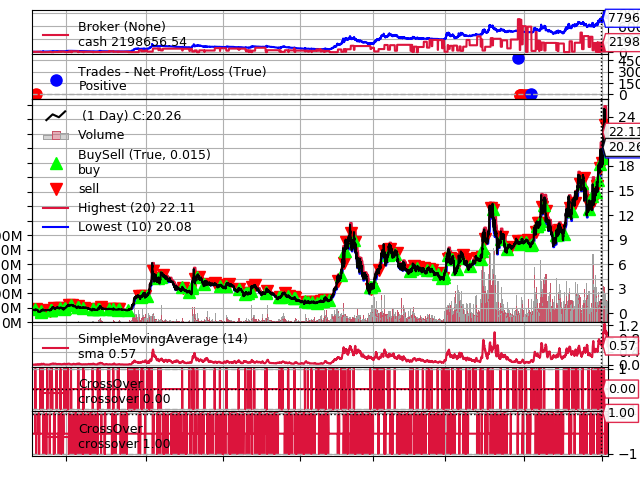

## 一、简介
&emsp;&emsp;可视化就是画出如下的图形：

&emsp;&emsp;图形中有三个Observer：Broker(Cash and Value), Trades和BuySell。画图用的是Cerebro中的plot()方法。

## 二、plot()详细介绍
&emsp;&emsp;plot()函数原型如下：
```python
plot(plotter=None, numfigs=1, iplot=True, start=None, end=None, width=16, height=9, dpi=300, tight=True, use=None, **kwargs)
```
- plotter：默认为None，画图的实例对象。如果为None，在plot()内用kwargs参数创建。
- numfigs：多少张图。用时间进行划分，比如numfigs=2，时间是两年，每张图都只画出一年的图
- iplot：如果为True，并且在notebook上运行，图形在行内显示
- start：画图的起始时间
- end：画图的结束时间
- width：保存图像的宽度(inches)
- height：保存图像的高度(inches)
- dpi：分辨率
- tight：仅仅保存实际内容
- use：没有用到

&emsp;&emsp;如果在实例化Cerebro时，把控制Observer的参数stdstats设置为False，也就是
```python
cerebro = bt.Cerebro(stdstats=False)
```
会提示如下错误：
```python
AttributeError: 'ItemCollection' object has no attribute 'broker'
```
也就是没有broker，无法画图。

## 三、plotter对象参数
&emsp;&emsp;我们在画图时，也许会这样输入参数：
```python
cere.plot(style='candle')
```
style不在plot()方法参数里，这个参数在plotter实例化时，传递给plotter。除了style外，plotter还有以下参数：
```python
# 紧凑模式是否只有x方向，还是y方向也一样
self.ytight = False

# 子图y方向的空白。不会覆盖plotinfo.plotymargin
self.yadjust = 0.0

# 新线条在前一个的上面还是下面。False表示画在上面
self.zdown = True

# 日期标签旋转
self.tickrotation = 15

# 整个图形，多少子集占据主要图形
self.rowsmajor = 5

# 整个图形，多少子集占据次要图形
self.rowsminor = 1

# 子图之间的距离
self.plotdist = 0.0

# 所有图形背景有一个网格
self.grid = True

# OHLC图形的线条样式，其他还有'bar'，'candle'
self.style = 'line'

# 收盘价线条默认颜色
self.loc = 'black'
# bar/candle阳线的默认颜色（0.75表示灰度强度）
self.barup = '0.75'
# bar/candle阴线的默认颜色
self.bardown = 'red'
# bar/candle的透明度
 self.bartrans = 1.0

# 蜡烛线是否需要填充或者透明
self.barupfill = True
self.bardownfill = True

# 是否透明填充蜡烛线（1：不透明 - 0：透明）
self.baralpha = 1.0

# 线条之间填充区域的alpha混合
self.fillalpha = 0.20

# 是否要画成交量曲线。如果数据中没有成交量数据，则不画
self.volume = True

# 是否在原图上画成交量曲线还是在单独的子图中画
self.voloverlay = True
# 当在原图上画的时候，对成交量数据进行缩放
self.volscaling = 0.33
# 将成交量取消画在上面
self.volpushup = 0.00

# 上涨时成交量曲线的颜色
self.volup = '#aaaaaa'  # 0.66 of gray
# 下跌时成交量曲线的颜色
self.voldown = '#cc6073'  # (204, 96, 115)
# 当重叠时，成交量曲线的透明度
self.voltrans = 0.50

# 文本标签的透明度（当前没用）
self.subtxttrans = 0.66
# 图标标签的字体大小
self.subtxtsize = 9

# 图形说明的透明度（当前没用）
self.legendtrans = 0.25
# 指标是否显示对应说明
self.legendind = True
#指标说明的位置(看matplotlib)
self.legendindloc = 'upper left'

# 数据说明的位置（看matplotlib）
self.legenddataloc = 'upper left'

# 是否显示曲线的最后一个值        
self.linevalues = True

# 在每个曲线最后一个值画上tag
self.valuetags = True

# 水平线条的颜色
self.hlinescolor = '0.66'  # shade of gray
# 水平线条的样式
self.hlinesstyle = '--'
# 水平线条的宽度
self.hlineswidth = 1.0

# 默认的颜色方案
self.lcolors = tableau10

# tick显示的格式
self.fmt_x_ticks = '%Y-%m-%d %H:%M'

# strftime格式字符串显示数据值
self.fmt_x_data = None
```
## 四、指标和观察者数据可视化
&emsp;&emsp;控制可视化的参数如下：
```python
plotinfo = dict(plot=True,
                subplot=True,
                plotname='',
                plotskip=False,
                plotabove=False,
                plotlinelabels=False,
                plotlinevalues=True,
                plotvaluetags=True,
                plotymargin=0.0,
                plotyhlines=[],
                plotyticks=[],
                plothlines=[],
                plotforce=False,
                plotmaster=None,
                plotylimited=True,
           )
```
有两种方式来修改这里的参数：
```python
sma = bt.indicators.SimpleMovingAverage(self.data, period=15, plotname='mysma')
# or
sma = bt.indicators.SimpleMovingAverage(self.data, period=15)
sma.plotinfo.plotname = 'mysma'
```
各个参数的意义如下：  
- plot: 是否需要显示
- subplot: 是否和数据一起显示还是在独立的子图中显示
- plotname: 替代类名的名字
- plotskip: plot的老名称，不赞成使用
- plotabove: 是否画在数据的上面
- plotlinelabels: 当supblot=False时，是否把每条线的名称显示在legend里
- plotlinevalues: 是否显示数的最后一个值
- plotvaluetags: 是否在右手边显示数据标签
- plotymargin: 子图的间隔
- plothlines: 水平线显示的可迭代容器数据
- plotyticks: an iterable containing values (within the scale) at which value ticks have to specifically be placed on the scale
- plotyhlines: 水平线显示的可迭代容器数据
- plotforce: 有时候指标会画图不成功，这是最后强制画图机制
- plotmaster: 一个指标或观察者有个主数据，但是有时候想要在另外一个数据上画图
- plotylimited: 当前仅用于data feeds。如果为True，其他数据不改变尺度，


